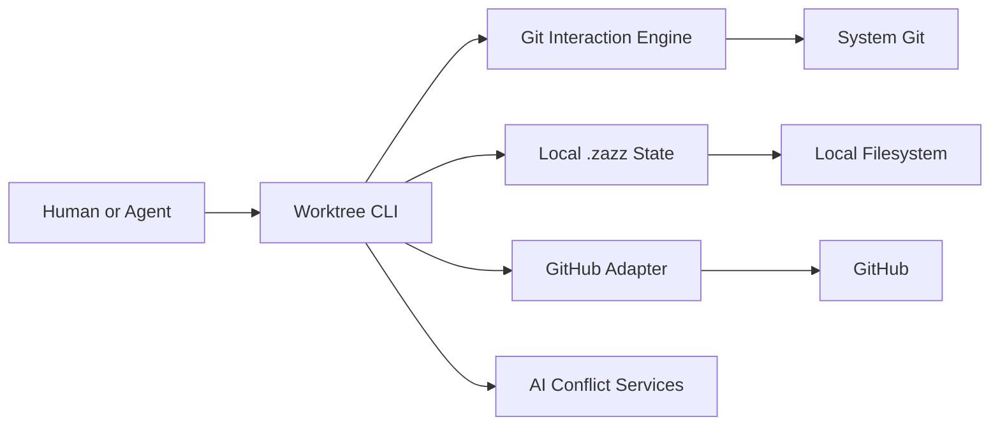
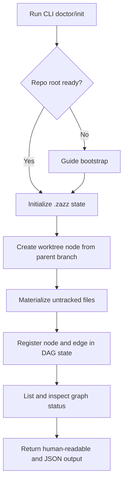
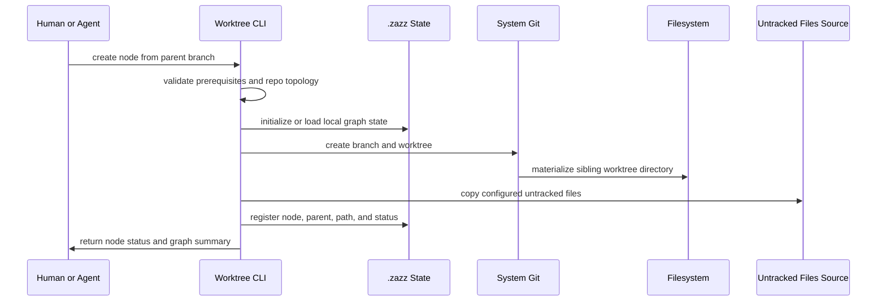
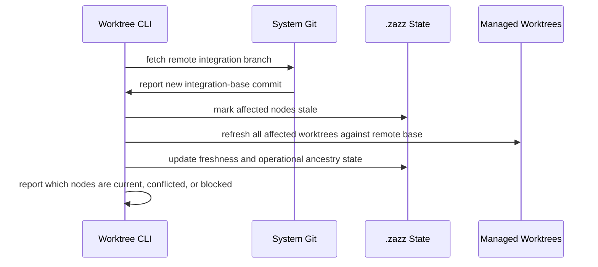
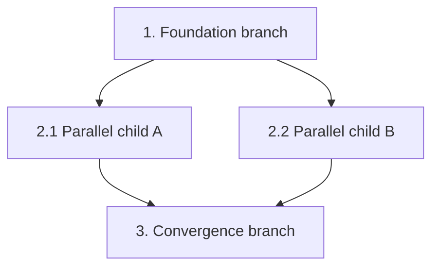

# Feature: zazzles Worktree Orchestration CLI
## Table of Contents
- [Feature Summary](#feature-summary)
- [Current Milestone / Next Milestone / Services Affected](#current-milestone--next-milestone--services-affected)
- [Introduction](#introduction)
- [Implementation Stack Direction](#implementation-stack-direction)
- [Feature Overview Diagrams](#feature-overview-diagrams)
- [Why This Feature Matters](#why-this-feature-matters)
- [Current State](#current-state)
- [Feature-Level Success Criteria](#feature-level-success-criteria)
- [Core Concepts](#core-concepts)
- [User Flows and System Flows](#user-flows-and-system-flows)
- [CLI Vocabulary and Surface Direction](#cli-vocabulary-and-surface-direction)
- [Command Capability Sections](#command-capability-sections)
- [Capability Baseline (All Milestones)](#capability-baseline-all-milestones)
- [Milestone Overview](#milestone-overview)
- [Milestone Details](#milestone-details)
- [Current State Summary](#current-state-summary)
- [Planned Future Evolution](#planned-future-evolution)
- [Risks, Constraints, and Non-Goals](#risks-constraints-and-non-goals)
- [Open Questions](#open-questions)
- [Deliverable Handoff Considerations](#deliverable-handoff-considerations)
- [References and Prior Art](#references-and-prior-art)

## Feature Summary

The zazzles Worktree Orchestration CLI is the primary execution surface for managing local worktree graphs, contributor workflows (commit, push, PR), parent-relative PR workflows, automated propagation, and agent-friendly orchestration on a single machine.

This feature exists so humans and agents can operate the product without depending on a desktop UI. It is the foundational user-facing capability that proves the product model before richer visualization and review experiences are layered on top.

At its core, the CLI exists to manage the chaos of out-of-order PR review and merge by keeping the local worktree graph coherent and by applying automation plus AI assistance to the propagation and conflict work that follows.

Over time, this feature should support multiple user journeys rather than only one bootstrap path:

- greenfield bootstrap into the opinionated zazzles repo-container model
- adoption of an already-existing compatible `.bare` plus sibling-worktree layout into zazzles management
- day-to-day operation of a managed graph of worktrees, branches, PRs, and agents

Navigation note:

- this main feature doc remains the authoritative capability source for the CLI
- companion docs under `docs/features/worktree-orchestration-cli/` organize the feature by command family and should be read as elaborations of this document, not separate capability definitions
- start with `docs/features/worktree-orchestration-cli/README.md` for the companion-doc map

## Current Milestone / Next Milestone / Services Affected

- Current milestone: M0 Proposed
- Next milestone: M1 CLI MVP
- Services affected:
  - local Git repository and repo root
  - local `.zazz/` state
  - GitHub PR integration
  - remote integration branch state
  - local AI-assisted conflict workflows

## Introduction

This feature defines the long-lived CLI capability of the product.

The CLI is not just an implementation convenience. It is the durable interface through which:

- agents perform worktree and graph operations
- humans inspect and operate the graph without needing the desktop app
- the team proves the product's automation model in real usage before UI polish is added

Under the Zazz framework, this is a valid feature because it describes a durable application capability over time, has clear milestone evolution, and is expected to remain part of the product even after the desktop app exists.

Document map:

- authoritative main feature doc: `docs/features/worktree-orchestration-cli.md`
- companion docs index: `docs/features/worktree-orchestration-cli/README.md`
- command-family companion docs:
  - `docs/features/worktree-orchestration-cli/init.md`
  - `docs/features/worktree-orchestration-cli/adopt-existing-layout.md`
  - `docs/features/worktree-orchestration-cli/add.md`
  - `docs/features/worktree-orchestration-cli/status-and-list.md`
  - `docs/features/worktree-orchestration-cli/inspect-and-graph.md`
  - `docs/features/worktree-orchestration-cli/sync-and-refresh.md`
  - `docs/features/worktree-orchestration-cli/conflicts-and-resolve.md`
  - `docs/features/worktree-orchestration-cli/profiles-and-auth.md`
  - `docs/features/worktree-orchestration-cli/contribution-lifecycle.md`

## Implementation Stack Direction

The current implementation direction for this feature is:

- Rust for the shared orchestration engine and the CLI application
- system `git` invocation for branch, worktree, fetch, rebase, push, and cleanup operations
- GitHub integration through a dedicated adapter layer
- M1 bootstrap behavior may use `gh` interoperability where that reduces setup friction
- M2 should replace M1 `gh` runtime dependencies for repo resolution and auth checks with native Rust provider operations
- repo-local state in `.zazz/`
- user-global product state in `~/.zazz/worktrees/`
- machine-readable JSON output for agent-facing operations
- public CLI invocation through `zaz`

Important clarification:

- this feature is not centered on GitHub CI as the primary execution model
- the core behavior runs locally on the user's machine
- GitHub is primarily the remote host and PR system for this feature
- GitHub Actions or other CI systems may validate branches later, but they are not the orchestration engine

Why this direction is preferred:

- Rust gives the project a strong foundation for a durable local engine and a reliable CLI
- calling system `git` in v1 is lower risk than re-implementing Git internals
- a dedicated GitHub adapter keeps PR awareness explicit without making the CLI dependent on a hosted control plane
- this keeps the CLI aligned with the proposal's broader Rust-first architecture while remaining practical to implement

GitHub dependency transition note:

- M1 may intentionally depend on the installed `gh` CLI for readiness and repo resolution checks.
- M2 should remove that runtime dependency by implementing native GitHub host operations in the Rust CLI.
- system `git` remains the source of truth for local branch/worktree mechanics across milestones.

## Feature Overview Diagrams

### CLI System Components



### M1 CLI Foundation Flow



### M1 Worktree Creation Sequence



### Remote Base Refresh Flow



## Why This Feature Matters

- Agents will always need a scriptable surface.
- The hardest product questions are orchestration questions, not UI questions.
- A CLI-first path lets the team validate worktree creation, PR lifecycle, propagation, and conflict behavior early.
- The CLI can be dogfooded while the product itself is being built.
- The desktop application can later become a companion feature built on top of a trusted engine and CLI workflow.
- The CLI is the first place where the product proves it can absorb unpredictable PR timing and keep downstream work moving anyway.

## Current State

Current state today:

- no implementation exists yet
- the product intent, architecture direction, and MVP sequencing have been drafted in the proposal
- the repo has the initial Zazz docs scaffold, proposal, standards index, and imported skills

What is not live yet:

- no CLI commands
- no local `.zazz/` graph state
- no worktree bootstrap logic
- no GitHub PR orchestration
- no propagation engine

## Feature-Level Success Criteria

This feature is successful when:

- a human or agent can operate the core product entirely through the CLI
- the CLI can create and manage the local worktree DAG on one machine
- the CLI can open and track parent-relative draft or ready-for-review PRs
- merged or updated upstream branches propagate forward through downstream branches with minimal manual work
- AI-assisted conflict handling is available when propagation is not clean
- the CLI remains the authoritative automation surface even after the desktop application ships
- the CLI reliably handles out-of-order review and merge events without forcing humans to manually babysit the graph
- core bootstrap and GitHub-host operations required by this feature can run without depending on the external `gh` binary once M2 is complete
- users can switch between multiple GitHub accounts and PAT-backed profiles without ad hoc shell reconfiguration
- profile defaults can be associated to directory scopes so repo roots under a given path resolve to the intended identity by default
- agents can execute a full human-equivalent contribution lifecycle in a worktree: commit, push, and create/update PRs with auditable state transitions
- sandbox-safe non-interactive profile, auth, and directory-association flows are validated against Claude Code and Codex execution environments

## Core Concepts

### Worktree node

A managed unit consisting of:

- a branch
- a local worktree path
- local DAG metadata
- optional PR state
- optional agent ownership state

The node identity must not depend on a numeric suffix in the branch or worktree name. Human-meaningful names are preferred, and the DAG metadata remains the source of truth for dependency relationships.

### Managed stack suffixes

For stacked branch lineages, the CLI should apply a managed numeric suffix convention without making that suffix the semantic source of truth.

Rules:

- the user may create the first branch in a line with any descriptive unsuffixed name
- the CLI should not require an initial `-0` suffix
- when the user creates the first stacked child from an unsuffixed managed branch, the CLI should rename the existing branch and worktree to `-1` and create the new child as `-2`
- when the user extends an already suffixed stacked line, the CLI should assign the next sequential suffix in that line
- if the parent branch has already been pushed and remote lifecycle management is active, the CLI must push the renamed branch first, confirm the new remote ref exists, and only then delete the old remote branch name as part of cleanup
- these suffixes are a user-facing lineage aid only; the actual DAG in `.zazz/` remains authoritative for dependency truth, merge handling, and convergence behavior

### Parent source

When creating a new managed worktree node, the parent may be:

- another local managed worktree node
- the configured remote integration branch such as `origin/main` or `origin/dev`

The CLI should support both patterns and track them consistently inside the same local DAG/state model.

### Untracked-file materialization

The process of copying or otherwise materializing configured untracked files into a newly created worktree so that the worktree is actually usable immediately.

Examples may include:

- `.env` files
- local editor or agent settings
- cached untracked support files
- other explicitly configured per-user or per-machine files required for normal development

This matters because standard Git branching keeps a user in one working directory, while managed worktrees create a new directory that would otherwise be missing those untracked files.

Materialization source rules:

- if a new worktree is created from another local managed worktree, untracked files should be materialized from that source worktree
- if a new worktree is created from the configured remote integration branch, untracked files should be materialized from the local integration worktree for `main` or `dev`
- the local integration worktree should therefore be treated as a stable, always-runnable source of truth for origin-rooted worktree creation

Future direction:

- M1 can treat untracked-file maintenance after worktree creation as a manual process
- a later desktop/client-oriented milestone should let the user diff untracked files in the current worktree against the integration worktree and explicitly choose which changes to accept back into that canonical source

### Graph edge

A dependency relationship indicating that one worktree node depends on another node's branch state.

### Dynamic DAG

The dependency graph is DAG-capable, but it is not assumed to be static. As PRs are reviewed, merged, refreshed, or reparented, the active operational graph may change.

### Intended dependency vs operational ancestry

The feature should distinguish between:

- intended dependency intent, meaning how units of work conceptually relate
- current operational ancestry, meaning which branch state a node is currently based on after merges, rebases, refreshes, or reparenting

This distinction matters because merge order may force the operational graph to shift even when the conceptual work breakdown remains the same.

### Propagation

The process of refreshing downstream nodes after upstream branches are updated or merged.

Within this feature, propagation is one of the central responsibilities of the CLI rather than a secondary convenience.

### Remote integration drift

The rule that local worktrees may become stale not only because of local ancestor changes, but also because the configured remote integration branch has advanced due to teammates merging other work.

The CLI must therefore:

- detect remote base movement
- show which nodes are stale relative to that base
- support refresh or rebase operations against the configured remote integration branch

### Conflict artifact

A repo-local record of a failed refresh or rebase that captures enough detail for a human or agent to continue the recovery flow deliberately.

A conflict artifact should include at least:

- the worktree path and branch
- the command or operation that was attempted
- the integration base or parent that was being applied
- the conflicting files
- the conflict status and next recommended action
- a stable artifact path that another agent can be pointed at

Conflict artifacts should live in repo-local orchestration state rather than only in transient terminal output.

### Repo-local versus user-global state

The feature should separate:

- repo-local orchestration state in `.zazz/` for DAG metadata, worktree registry, conflict artifacts, and operation state tied to one repository
- user-global state in `~/.zazz/` for machine-level preferences, provider credentials, caches, logs, reusable agent settings, and product-family configuration

The DAG and per-repo conflict state should remain canonical inside `.zazz/`.

The same product name is used in both places, but the scope is determined by location:

- `.zazz/` inside the repo root is repo-local orchestration state
- `~/.zazz/` in the user home directory is user-global Zazz family state used by zazzles and related Zazz tooling

Recommended user-global layout:

```text
~/.zazz/
├── worktrees/
│   ├── config.toml
│   ├── providers.toml
│   ├── logs/
│   └── cache/
├── board/
│   ├── config.toml
│   └── cache/
└── shared/
    ├── auth/
    └── profiles/
```

Recommended repo-local layout:

```text
repo-root/
├── .bare/
├── .zazz/
│   ├── config.toml
│   ├── graph.json
│   ├── worktrees.json
│   ├── conflicts/
│   └── locks/
├── <integration-branch>/
└── feature-worktree/
```

Adoption note:

- the layout above is the preferred managed shape for greenfield bootstrap
- a later milestone should also support adopting an existing compatible bare-repo plus sibling-worktree container into zazzles management without rebuilding it from scratch
- adoption should be limited to compatible layouts that already follow the core `.bare/` plus sibling-worktree model closely enough to infer trustworthy repo-root topology

### GitHub profile and credential scope

The feature must support real-world multi-account and multi-organization usage where one developer may work across multiple GitHub identities and PATs.

Profile requirements:

- the CLI should support named GitHub auth profiles in user-global state (for example personal, work-org-a, work-org-b)
- each profile should include at least:
  - GitHub host
  - account and owner defaults used for bare-name repo resolution
  - Git author identity defaults (`user.name`, `user.email`) for repo/worktree operations
  - a secure credential reference for PAT retrieval
- profile selection should be explicit per command and optionally sticky per repo
- the CLI should support directory-scoped default profile association so all repos under a configured path inherit a profile unless overridden
- directory-profile association must be configurable through non-interactive commands so agents can manage it inside sandboxed execution environments without TTY prompts

Directory association semantics:

- associations should support path-prefix matching, such as mapping `~/Dev/zazzcode/` to a specific profile
- effective-profile precedence should be:
  1. explicit command flag
  2. repo-local pinned profile
  3. best matching directory association
  4. global default profile
- this model should mirror the intent of Git's conditional includes for directory scoping while preserving zazzles-specific profile semantics
- this model must remain executable by agents that do not run in an interactive terminal session

Credential storage and execution requirements:

- PATs must not be written to repo-local `.zazz/` state
- PATs should be stored in a secure user-global mechanism (for example OS keychain or encrypted user-global auth store)
- the CLI should provide an explicit non-interactive auth handoff path for agents running in sandboxes that do not inherit the caller's shell environment
- agent handoff should materialize credentials ephemerally for command execution, with redaction-safe logs and no plaintext persistence in repo-local files

### Graph-aware merge order

The rule that creation order does not guarantee review or merge order. The CLI must follow actual dependency relationships and current merged state, not assume that lower-numbered or earlier-created nodes always complete first.

In practice, this works like a normal human team:

- whichever PR gets reviewed and merged first may simply be the one that got attention first
- the CLI must therefore treat out-of-order merge completion as routine and automatically drive the required downstream refresh behavior

This is the main operational value of the feature, not just an edge case to support.

### Draft PR checkpoint

A branch-level review checkpoint that allows human visibility before final merge readiness.

### Human ownership boundary

AI and agents may implement, synchronize, and propose resolutions, but a human remains accountable for approval and merge.

## User Flows and System Flows

### Primary CLI flow

1. From a parent directory, initialize a repo root with `zaz init <repo-name>`, where the repo name and directory name must match.
2. Create a worktree node from a chosen parent.
3. If the operation turns an unsuffixed branch into a stacked lineage, rename the existing node to `-1`, create the new node as `-2`, and, when remote lifecycle management is active, push the renamed parent before deleting the old remote branch name.
4. Register the resulting nodes in `.zazz/`.
5. Stage and commit worktree changes with repo/profile-aware author identity.
6. Push branch updates using the active profile credentials.
7. Open or update a draft PR against the parent branch.
8. Continue downstream work in additional nodes.
9. Detect upstream updates or merges.
10. Propagate those changes downstream.
11. Resolve conflicts with AI assistance or semantic migration when needed.
12. Detect when the remote integration branch has advanced and refresh affected nodes as needed.

### Existing repo-container adoption flow

1. User points `zaz` at an already-existing repo container that uses a compatible `.bare/` plus sibling-worktree layout.
2. CLI validates that the repo root, bare Git directory, and visible worktrees are structurally compatible with zazzles expectations.
3. CLI detects or confirms the integration worktree and basic repo identity.
4. CLI initializes `.zazz/` state for that repo without recloning or recreating the worktrees.
5. CLI imports the existing worktree registry and establishes initial graph state with explicit limits on what can and cannot be inferred automatically.
6. User reviews the imported state and resolves any ambiguous parentage, naming, or missing metadata before advanced orchestration features are enabled.

Important adoption constraint:

- adoption should be additive and low-risk, not a best-effort rewrite of arbitrary local repo shapes
- the CLI should only adopt layouts that are close enough to the expected bare-repo container model to avoid corrupting user state or inventing incorrect graph truth

Important flow nuance:

- node creation order does not guarantee PR completion order
- smaller downstream branches may be reviewed and merged before larger earlier-created branches
- the CLI must therefore compute propagation from the actual dependency graph and current branch state, not from naming sequence alone
- when merge order changes the effective branch ancestry, the CLI must be able to refresh or reshape the active operational graph without losing track of the original work intent
- the CLI must also account for remote branch movement caused by other developers working in the same repository

### Status and worktree list flow

The CLI should provide a `list` or `status` style command that shows, for each managed worktree node:

- branch and worktree path
- parent dependency
- PR state when present
- whether it is current relative to its parent
- whether it is stale relative to the configured remote integration branch
- whether it needs refresh, conflict resolution, or migration

This status view should include both:

- worktrees that branch from other local managed nodes
- worktrees that branch directly from the configured remote integration branch

### Account and profile selection flow

1. User creates or updates one or more account profiles with owner defaults, Git identity defaults, and secure PAT references.
2. User optionally associates one or more directory roots with a profile.
3. When a command runs, the CLI resolves the effective profile using precedence:
   - explicit command profile
   - repo-local pinned profile
   - best matching directory association
   - global default profile
4. CLI retrieves credentials through secure user-global storage and applies them ephemerally for the command execution.
5. CLI emits redaction-safe output and records enough metadata for troubleshooting without exposing PAT values.

Agent execution requirement:

- all profile and directory-association operations above must be available through non-interactive command contracts for sandboxed agents.

### Recovery flow

1. A refresh or rebase operation fails with conflicts.
2. CLI marks the node as conflicted or migration-required.
3. CLI saves a repo-local conflict artifact for that failed operation.
4. CLI returns machine-readable conflict status, including the artifact path and affected worktree.
5. A human or orchestrator points an agent at that artifact and worktree.
6. The agent resolves directly in the worktree or proposes a resolution.
7. CLI reconciles the result and refreshes DAG state.

### Example DAG flow

This numbered DAG sketch is intentionally level-aware: `3` is a convergence step after `2.1` and `2.2`, not a peer of them.



## CLI Vocabulary and Surface Direction

The public command should be `zaz`. The CLI should feel familiar to users who already know `git` and `gh`, while still exposing zazzles-specific graph and orchestration behavior clearly.

Direction:

- use `zaz` as the top-level command
- make `zaz --help` the primary discoverability entry point for humans
- keep the command families Git-like and verb-first where possible
- treat worktrees as the default operating model, so the core lifecycle commands should not require a redundant `worktree` noun
- prefer human-readable defaults with `--json` for agent consumption
- make help and error output part of the contract, not an afterthought

Milestone 1 should explicitly define these initial command families:

- `zaz init`
- `zaz status`
- `zaz add`
- `zaz list`
- `zaz inspect`
- `zaz remove`
- `zaz graph ...`
- `zaz sync ...`
- `zaz conflicts ...`
- `zaz resolve ...`

Future CLI administration capability to add after the M1 bootstrap and worktree flows are stable:

- `zaz config ...` for viewing and updating user-global defaults such as the default integration branch
- `zaz account ...` for profile lifecycle and account switching
- `zaz auth ...` for secure profile credential setup and validation
- `zaz profile ...` for directory association and repo/profile binding operations

Illustrative command shape:

```sh
zaz --help
zaz init zazzles
zaz init zazzles --integration dev
zaz status
zaz add auth-foundation --from dev
zaz add auth-foundation --from auth-foundation
zaz list
zaz inspect auth-foundation-2
zaz graph auth-foundation-2
zaz sync refresh --all
zaz sync refresh auth-foundation-2
zaz conflicts show auth-foundation-2
zaz resolve auth-foundation-2
```

In this example, the second `add` turns the original `auth-foundation` branch into `auth-foundation-1` and creates the new child as `auth-foundation-2`.

The exact final command families may still evolve, but Milestone 1 should explicitly define the public CLI vocabulary rather than leaving it implicit in implementation.

Planned M2 command families for native provider and account/auth operation:

- `zaz account list`
- `zaz account use <profile>`
- `zaz auth login --profile <profile>`
- `zaz auth status [--profile <profile>]`
- `zaz profile set-dir <path> --account <profile>`
- `zaz profile inspect --cwd`

Planned M3 command families for human-equivalent contribution workflows:
- `zaz commit --worktree <name> --message <msg>`
- `zaz push <name>`
- `zaz pr create <name>`
- `zaz pr update <name>`

Important milestone note:

- reading user-global config during `zaz init` is part of the bootstrap direction
- editing user-global config through a first-class `zaz config` command is future work and should be planned as a later CLI milestone rather than added to the current `init-add-worktree` deliverable

## Command Capability Sections

The main feature document is the authoritative source of capability scope for the CLI.

Companion command-family docs live under:

- `docs/features/worktree-orchestration-cli/`

Those companion docs exist to keep the feature easier to navigate. They must elaborate and organize the capability families below, not introduce new product capabilities that are absent from this main feature document.

### C1. Repo bootstrap and existing-layout adoption

This capability family defines how a repo becomes managed by zazzles.

Core expectations:

- initialize a new repo container in the opinionated `.bare/` plus sibling-worktree layout
- validate prerequisites and host/repo readiness before mutating local state
- initialize `.zazz/` safely and deterministically
- support a later adoption path for an already-existing compatible bare-repo container without recloning or rebuilding it
- detect or confirm the integration worktree and repo identity
- keep repo-local orchestration truth in `.zazz/` once the repo is managed

Primary command families:

- `zaz init`
- future adoption surface such as `zaz adopt ...` or an explicit adopt mode on `zaz init`

Companion docs:

- `docs/features/worktree-orchestration-cli/init.md`
- `docs/features/worktree-orchestration-cli/adopt-existing-layout.md`

### C2. Managed worktree lifecycle and materialization

This capability family defines how managed worktrees are created, named, prepared, and removed.

Core expectations:

- create a new managed worktree from an integration base or another managed parent
- preserve the one-branch-per-worktree model
- apply stack suffix rules without making suffixes the source of dependency truth
- materialize configured untracked files into new worktrees
- keep shared excludes and repo-specific setup conventions consistent
- remove or clean up managed worktrees safely

Primary command families:

- `zaz add`
- `zaz remove`

Companion docs:

- `docs/features/worktree-orchestration-cli/add.md`

### C3. Status, listing, inspection, and graph visibility

This capability family defines how humans and agents understand the current graph state.

Core expectations:

- list managed worktrees and their readiness
- inspect one node's parent, children, freshness, and PR context
- render graph-oriented status in human-readable and machine-readable forms
- distinguish stale relative to parent from stale relative to integration base
- make graph truth easier to understand than raw Git or GitHub output alone

Primary command families:

- `zaz status`
- `zaz list`
- `zaz inspect`
- `zaz graph ...`

Companion docs:

- `docs/features/worktree-orchestration-cli/status-and-list.md`
- `docs/features/worktree-orchestration-cli/inspect-and-graph.md`

### C4. Sync, refresh, propagation, and merge-order resilience

This capability family defines how the graph stays convergent as local parents and the remote integration branch evolve.

Core expectations:

- refresh worktrees against the configured integration base
- propagate upstream updates through downstream nodes in dependency order
- handle out-of-order review and merge completion without losing graph truth
- track remote integration drift as a first-class stale-state cause
- keep refresh results observable and machine-readable

Primary command families:

- `zaz sync ...`

Companion docs:

- `docs/features/worktree-orchestration-cli/sync-and-refresh.md`

### C5. Conflict capture, recovery, and resolution handoff

This capability family defines how failed refresh or merge operations become durable, recoverable workflows.

Core expectations:

- capture failed operations as durable repo-local conflict artifacts
- classify and expose conflict state clearly
- provide machine-readable recovery contracts for humans and agents
- support AI-assisted resolution with explicit human visibility
- reconcile success or failure back into `.zazz/` state

Primary command families:

- `zaz conflicts ...`
- `zaz resolve ...`

Companion docs:

- `docs/features/worktree-orchestration-cli/conflicts-and-resolve.md`

### C6. Profiles, auth, identity, and directory-scoped defaults

This capability family defines how zazzles supports real-world multi-account and multi-organization work.

Core expectations:

- named profiles for GitHub host/account defaults and Git author identity defaults
- secure PAT handling without writing secrets into repo-local state
- explicit per-command profile selection
- repo-level and directory-level profile association with deterministic precedence
- non-interactive auth and credential handoff for sandboxed agents

Primary command families:

- future `zaz account ...`
- future `zaz auth ...`
- future `zaz profile ...`
- future `zaz config ...`

Companion docs:

- `docs/features/worktree-orchestration-cli/profiles-and-auth.md`

### C7. Contribution lifecycle and PR operations

This capability family defines how a managed worktree becomes a complete contribution unit.

Core expectations:

- stage and commit with profile-aware identity defaults
- push branches safely
- create and update draft or ready-for-review PRs
- mirror relevant PR state back into local graph state
- preserve parent-relative PR review as a first-class workflow

Primary command families:

- future `zaz commit ...`
- future `zaz push ...`
- future `zaz pr ...`

Companion docs:

- `docs/features/worktree-orchestration-cli/contribution-lifecycle.md`

## Capability Baseline (All Milestones)

Regardless of milestone sequencing, the CLI feature consists of the seven durable capability sections above:

- `C1` Repo bootstrap and existing-layout adoption
- `C2` Managed worktree lifecycle and materialization
- `C3` Status, listing, inspection, and graph visibility
- `C4` Sync, refresh, propagation, and merge-order resilience
- `C5` Conflict capture, recovery, and resolution handoff
- `C6` Profiles, auth, identity, and directory-scoped defaults
- `C7` Contribution lifecycle and PR operations

Milestones should sequence, constrain, and deepen these capability sections. They should not introduce new top-level capability families that are absent from the main feature document.

## Milestone Overview

| Milestone | Status | Outcome |
| --- | --- | --- |
| M1 | Proposed | First fully useful CLI milestone covering greenfield bootstrap and the core local orchestration path across `C1`-`C5` |
| M2 | Proposed | Native provider and multi-account milestone covering the host/auth parts of `C1` and all of `C6` |
| M3 | Proposed | Collaboration and adoption milestone covering existing-layout adoption, `C4`, `C5`, `C7`, and advanced maintenance inside `C2` |

## Milestone Details

### M1: CLI MVP

Covered capability sections:

- `C1` Repo bootstrap and existing-layout adoption
- `C2` Managed worktree lifecycle and materialization
- `C3` Status, listing, inspection, and graph visibility
- `C4` Sync, refresh, propagation, and merge-order resilience
- `C5` Conflict capture, recovery, and resolution handoff

Scope constraints:

- M1 is the first fully useful CLI milestone and should be valuable on its own for real day-to-day usage
- M1 should establish the public `zaz` surface clearly enough that `zaz --help` is already a stable entry point
- M1 should stay greenfield-first for `C1`: `zaz init` remains fresh-bootstrap only in this milestone
- M1 should establish machine-readable output and durable `.zazz/` state across the covered capability sections

Primary companion docs for this milestone:

- `docs/features/worktree-orchestration-cli/init.md`
- `docs/features/worktree-orchestration-cli/add.md`
- `docs/features/worktree-orchestration-cli/status-and-list.md`
- `docs/features/worktree-orchestration-cli/inspect-and-graph.md`
- `docs/features/worktree-orchestration-cli/sync-and-refresh.md`
- `docs/features/worktree-orchestration-cli/conflicts-and-resolve.md`

### M2: Native GitHub operations and profile-aware auth

Covered capability sections:

- host- and provider-specific parts of `C1`
- all of `C6`

Scope constraints:

- replace M1 `gh` runtime dependencies with native provider operations where the feature already calls for them
- keep repo-name and owner/repo resolution deterministic across profiles
- make profile, identity, and auth flows work reliably in non-interactive agent environments

Primary companion docs for this milestone:

- `docs/features/worktree-orchestration-cli/init.md`
- `docs/features/worktree-orchestration-cli/profiles-and-auth.md`

### M3: Collaboration lifecycle and advanced maintenance flows

Covered capability sections:

- adoption parts of `C1`
- advanced maintenance parts of `C2`
- deeper propagation and merge-order handling in `C4`
- advanced recovery workflows in `C5`
- all of `C7`

Scope constraints:

- make incremental adoption possible for users already on a compatible `.bare` layout
- move the CLI from local orchestration into full contribution lifecycle operations
- deepen propagation and maintenance workflows without changing the capability boundaries defined above

Primary companion docs for this milestone:

- `docs/features/worktree-orchestration-cli/adopt-existing-layout.md`
- `docs/features/worktree-orchestration-cli/sync-and-refresh.md`
- `docs/features/worktree-orchestration-cli/conflicts-and-resolve.md`
- `docs/features/worktree-orchestration-cli/contribution-lifecycle.md`
- `docs/features/worktree-orchestration-cli/add.md`

## Current State Summary

The feature is currently proposed only. No milestones have shipped yet.

## Planned Future Evolution

- native GitHub operations and profile-aware auth should become the next milestone after origin-refresh and conflict-handoff behavior is stable
- adoption of an already-existing compatible `.bare` repo-container should become a priority before desktop UX so teams with established worktree conventions can onboard incrementally
- PR lifecycle automation should follow after native provider and profile capabilities are in place
- parent-to-child propagation after local PR merge should land in a later milestone after origin-refresh behavior is stable
- desktop visualization and review should build on top of this feature rather than replacing it
- a later desktop/client milestone should support reviewing untracked files in the current worktree against the integration worktree and help the user accept selected updates back into that integration-worktree source of truth
- future multi-machine or multi-user coordination may extend this feature, but that is out of MVP scope
- future AI-assisted PR review may complement the CLI, but human sign-off remains mandatory

## Risks, Constraints, and Non-Goals

Risks:

- Git edge cases may make propagation and recovery trickier than expected
- DAG semantics can become confusing without careful CLI language and state reporting
- AI-assisted conflict resolution must be observable and reviewable to maintain trust
- the distinction between intended work structure and current branch ancestry can become confusing if the CLI does not represent it clearly
- repo-local conflict artifacts must remain clean and discoverable or they will become their own source of chaos

Constraints:

- one-machine local orchestration for the initial release
- GitHub as first remote host
- flat sibling worktree naming and managed repo-root layout
- existing-layout adoption should only support compatible bare-repo container shapes, not arbitrary historical repo directories
- branch and worktree names should be descriptive, with CLI-managed `-1`, `-2`, and later suffixes used for stacked lineage only and never as dependency truth
- newly created worktrees should be made usable without forcing the user to manually recopy common untracked files every time

Non-goals:

- replacing the need for a human approver
- requiring the desktop app for core workflows
- distributed shared-state coordination in v1

## Open Questions

- how strict should compatible-layout detection be for adopting an existing `.bare` plus sibling-worktree repo container?
- which parts of graph state can be inferred safely during adoption, and which should require explicit user confirmation?
- should propagation run only on clean working states, or can the CLI safely manage dirty worktrees?
- how much AI context should be included by default during conflict resolution?
- should intended work dependencies and current operational ancestry be stored as separate graph layers in `.zazz/`, or derived from a single richer model?
- should untracked files be copied, symlinked, or managed by a per-repo materialization strategy depending on file type?
- should untracked-file maintenance eventually gain a desktop/client diff-and-accept workflow against the integration worktree, and if so what should the acceptance/write-back UX look like?
- what should the exact schema and naming convention be for saved conflict artifacts under `.zazz/`?
- what secure storage abstraction should back profile PAT retrieval consistently across macOS, Linux, and Windows?
- what should the profile-selection precedence be across global default, repo default, and per-command override?

## Deliverable Handoff Considerations

The next deliverables should likely start with:

- CLI foundation and local DAG metadata
- worktree creation and untracked-file materialization
- remote-base refresh
- conflict artifact capture

Recommended first deliverable:

- implement the first slice of M1 around worktree bootstrap, untracked-file materialization, and readiness verification so a new managed worktree is usable immediately

Core M1 deliverables that should be called out explicitly:

- local `.zazz/` DAG/state structure design and bootstrap
- local integration-worktree convention and management
- CLI worktree creation in the opinionated repo-root model
- automatic copying or materialization of untracked files into new worktrees
- repo-local conflict artifact capture for failed origin refreshes

The desktop application should be specified as a separate feature that depends on this feature's core workflows rather than replacing them.

## References and Prior Art

- Git conditional includes (`includeIf "gitdir:..."`) for directory-scoped config behavior:
  - <https://git-scm.com/docs/git-config#_conditional_includes>
- Git credential context and helper model:
  - <https://git-scm.com/docs/gitcredentials>
- Git credential helper command contract:
  - <https://git-scm.com/docs/git-credential>
- GitHub CLI authentication behavior and host/account management:
  - <https://cli.github.com/manual/gh_auth_login>
  - <https://cli.github.com/manual/gh_auth_status>
- Worktrunk configuration, path templates, project-specific settings, and diagnostics:
  - <https://worktrunk.dev/config/>
- Worktrunk FAQ and positioning relative to plain `git worktree`:
  - <https://worktrunk.dev/faq/>
- GitButler parallel branches in a single working directory:
  - <https://docs.gitbutler.com/features/branch-management/virtual-branches>
- GitButler stacked branches and local PR-stack orchestration:
  - <https://docs.gitbutler.com/features/branch-management/stacked-branches>
