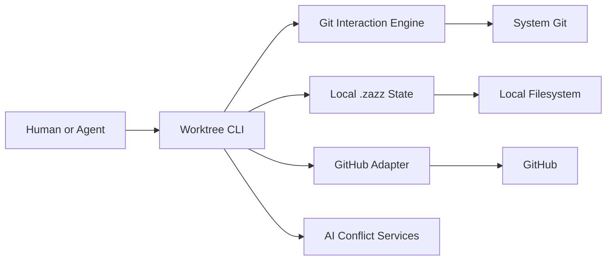
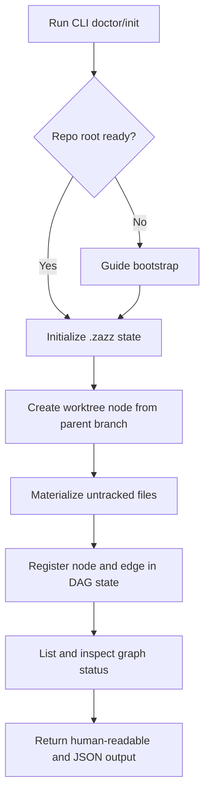
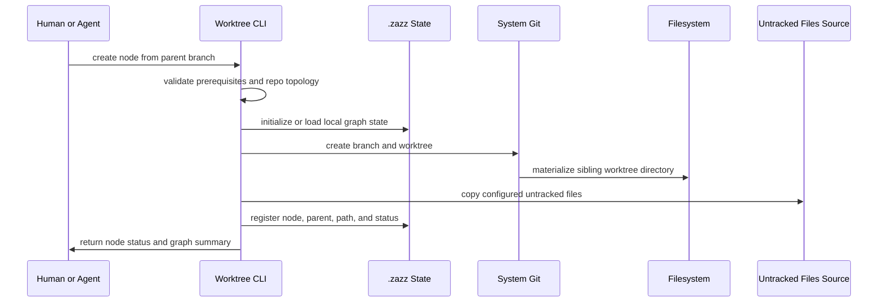
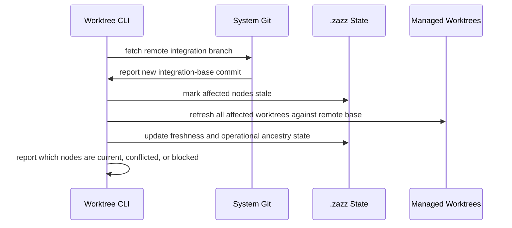
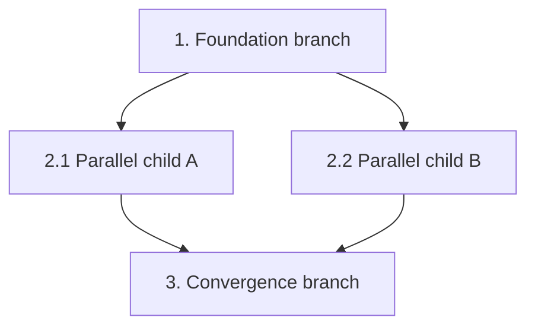

# Feature: zazzles Worktree Orchestration CLI

## Feature Summary

The zazzles Worktree Orchestration CLI is the primary execution surface for managing local worktree graphs, parent-relative PR workflows, automated propagation, and agent-friendly orchestration on a single machine.

This feature exists so humans and agents can operate the product without depending on a desktop UI. It is the foundational user-facing capability that proves the product model before richer visualization and review experiences are layered on top.

At its core, the CLI exists to manage the chaos of out-of-order PR review and merge by keeping the local worktree graph coherent and by applying automation plus AI assistance to the propagation and conflict work that follows.

## Current Milestone / Next Milestone / Services Affected

- Current milestone: M0 Proposed
- Next milestone: M1 CLI MVP
- Services affected:
  - local Git repository and repo root
  - local `.zazz/` state
  - GitHub PR integration
  - remote integration branch state
  - local AI-assisted conflict workflows

## Introduction

This feature defines the long-lived CLI capability of the product.

The CLI is not just an implementation convenience. It is the durable interface through which:

- agents perform worktree and graph operations
- humans inspect and operate the graph without needing the desktop app
- the team proves the product's automation model in real usage before UI polish is added

Under the Zazz framework, this is a valid feature because it describes a durable application capability over time, has clear milestone evolution, and is expected to remain part of the product even after the desktop app exists.

## Implementation Stack Direction

The current implementation direction for this feature is:

- Rust for the shared orchestration engine and the CLI application
- system `git` invocation for branch, worktree, fetch, rebase, push, and cleanup operations
- GitHub integration through a dedicated adapter layer
- M1 bootstrap behavior may use `gh` interoperability where that reduces setup friction
- M2 should replace M1 `gh` runtime dependencies for repo resolution and auth checks with native Rust provider operations
- repo-local state in `.zazz/`
- user-global product state in `~/.zazz/worktrees/`
- machine-readable JSON output for agent-facing operations
- public CLI invocation through `zaz`

Important clarification:

- this feature is not centered on GitHub CI as the primary execution model
- the core behavior runs locally on the user's machine
- GitHub is primarily the remote host and PR system for this feature
- GitHub Actions or other CI systems may validate branches later, but they are not the orchestration engine

Why this direction is preferred:

- Rust gives the project a strong foundation for a durable local engine and a reliable CLI
- calling system `git` in v1 is lower risk than re-implementing Git internals
- a dedicated GitHub adapter keeps PR awareness explicit without making the CLI dependent on a hosted control plane
- this keeps the CLI aligned with the proposal's broader Rust-first architecture while remaining practical to implement

GitHub dependency transition note:

- M1 may intentionally depend on the installed `gh` CLI for readiness and repo resolution checks.
- M2 should remove that runtime dependency by implementing native GitHub host operations in the Rust CLI.
- system `git` remains the source of truth for local branch/worktree mechanics across milestones.

## Feature Overview Diagrams

### CLI System Components



### M1 CLI Foundation Flow



### M1 Worktree Creation Sequence



### Remote Base Refresh Flow



## Why This Feature Matters

- Agents will always need a scriptable surface.
- The hardest product questions are orchestration questions, not UI questions.
- A CLI-first path lets the team validate worktree creation, PR lifecycle, propagation, and conflict behavior early.
- The CLI can be dogfooded while the product itself is being built.
- The desktop application can later become a companion feature built on top of a trusted engine and CLI workflow.
- The CLI is the first place where the product proves it can absorb unpredictable PR timing and keep downstream work moving anyway.

## Current State

Current state today:

- no implementation exists yet
- the product intent, architecture direction, and MVP sequencing have been drafted in the proposal
- the repo has the initial Zazz docs scaffold, proposal, standards index, and imported skills

What is not live yet:

- no CLI commands
- no local `.zazz/` graph state
- no worktree bootstrap logic
- no GitHub PR orchestration
- no propagation engine

## Feature-Level Success Criteria

This feature is successful when:

- a human or agent can operate the core product entirely through the CLI
- the CLI can create and manage the local worktree DAG on one machine
- the CLI can open and track parent-relative draft or ready-for-review PRs
- merged or updated upstream branches propagate forward through downstream branches with minimal manual work
- AI-assisted conflict handling is available when propagation is not clean
- the CLI remains the authoritative automation surface even after the desktop application ships
- the CLI reliably handles out-of-order review and merge events without forcing humans to manually babysit the graph
- core bootstrap and GitHub-host operations required by this feature can run without depending on the external `gh` binary once M2 is complete

## Core Concepts

### Worktree node

A managed unit consisting of:

- a branch
- a local worktree path
- local DAG metadata
- optional PR state
- optional agent ownership state

The node identity must not depend on a numeric suffix in the branch or worktree name. Human-meaningful names are preferred, and the DAG metadata remains the source of truth for dependency relationships.

### Managed stack suffixes

For stacked branch lineages, the CLI should apply a managed numeric suffix convention without making that suffix the semantic source of truth.

Rules:

- the user may create the first branch in a line with any descriptive unsuffixed name
- the CLI should not require an initial `-0` suffix
- when the user creates the first stacked child from an unsuffixed managed branch, the CLI should rename the existing branch and worktree to `-1` and create the new child as `-2`
- when the user extends an already suffixed stacked line, the CLI should assign the next sequential suffix in that line
- if the parent branch has already been pushed and remote lifecycle management is active, the CLI must push the renamed branch first, confirm the new remote ref exists, and only then delete the old remote branch name as part of cleanup
- these suffixes are a user-facing lineage aid only; the actual DAG in `.zazz/` remains authoritative for dependency truth, merge handling, and convergence behavior

### Parent source

When creating a new managed worktree node, the parent may be:

- another local managed worktree node
- the configured remote integration branch such as `origin/main` or `origin/dev`

The CLI should support both patterns and track them consistently inside the same local DAG/state model.

### Untracked-file materialization

The process of copying or otherwise materializing configured untracked files into a newly created worktree so that the worktree is actually usable immediately.

Examples may include:

- `.env` files
- local editor or agent settings
- cached untracked support files
- other explicitly configured per-user or per-machine files required for normal development

This matters because standard Git branching keeps a user in one working directory, while managed worktrees create a new directory that would otherwise be missing those untracked files.

Materialization source rules:

- if a new worktree is created from another local managed worktree, untracked files should be materialized from that source worktree
- if a new worktree is created from the configured remote integration branch, untracked files should be materialized from the local integration worktree for `main` or `dev`
- the local integration worktree should therefore be treated as a stable, always-runnable source of truth for origin-rooted worktree creation

Future direction:

- M1 can treat untracked-file maintenance after worktree creation as a manual process
- a later desktop/client-oriented milestone should let the user diff untracked files in the current worktree against the integration worktree and explicitly choose which changes to accept back into that canonical source

### Graph edge

A dependency relationship indicating that one worktree node depends on another node's branch state.

### Dynamic DAG

The dependency graph is DAG-capable, but it is not assumed to be static. As PRs are reviewed, merged, refreshed, or reparented, the active operational graph may change.

### Intended dependency vs operational ancestry

The feature should distinguish between:

- intended dependency intent, meaning how units of work conceptually relate
- current operational ancestry, meaning which branch state a node is currently based on after merges, rebases, refreshes, or reparenting

This distinction matters because merge order may force the operational graph to shift even when the conceptual work breakdown remains the same.

### Propagation

The process of refreshing downstream nodes after upstream branches are updated or merged.

Within this feature, propagation is one of the central responsibilities of the CLI rather than a secondary convenience.

### Remote integration drift

The rule that local worktrees may become stale not only because of local ancestor changes, but also because the configured remote integration branch has advanced due to teammates merging other work.

The CLI must therefore:

- detect remote base movement
- show which nodes are stale relative to that base
- support refresh or rebase operations against the configured remote integration branch

### Conflict artifact

A repo-local record of a failed refresh or rebase that captures enough detail for a human or agent to continue the recovery flow deliberately.

A conflict artifact should include at least:

- the worktree path and branch
- the command or operation that was attempted
- the integration base or parent that was being applied
- the conflicting files
- the conflict status and next recommended action
- a stable artifact path that another agent can be pointed at

Conflict artifacts should live in repo-local orchestration state rather than only in transient terminal output.

### Repo-local versus user-global state

The feature should separate:

- repo-local orchestration state in `.zazz/` for DAG metadata, worktree registry, conflict artifacts, and operation state tied to one repository
- user-global state in `~/.zazz/` for machine-level preferences, provider credentials, caches, logs, reusable agent settings, and product-family configuration

The DAG and per-repo conflict state should remain canonical inside `.zazz/`.

The same product name is used in both places, but the scope is determined by location:

- `.zazz/` inside the repo root is repo-local orchestration state
- `~/.zazz/` in the user home directory is user-global Zazz family state used by zazzles and related Zazz tooling

Recommended user-global layout:

```text
~/.zazz/
├── worktrees/
│   ├── config.toml
│   ├── providers.toml
│   ├── logs/
│   └── cache/
├── board/
│   ├── config.toml
│   └── cache/
└── shared/
    ├── auth/
    └── profiles/
```

Recommended repo-local layout:

```text
repo-root/
├── .bare/
├── .zazz/
│   ├── config.toml
│   ├── graph.json
│   ├── worktrees.json
│   ├── conflicts/
│   └── locks/
├── <integration-branch>/
└── feature-worktree/
```

### GitHub profile and credential scope

The feature must support real-world multi-account and multi-organization usage where one developer may work across multiple GitHub identities and PATs.

Profile requirements:

- the CLI should support named GitHub auth profiles in user-global state (for example personal, work-org-a, work-org-b)
- each profile should include at least:
  - GitHub host
  - account and owner defaults used for bare-name repo resolution
  - Git author identity defaults (`user.name`, `user.email`) for repo/worktree operations
  - a secure credential reference for PAT retrieval
- profile selection should be explicit per command and optionally sticky per repo

Credential storage and execution requirements:

- PATs must not be written to repo-local `.zazz/` state
- PATs should be stored in a secure user-global mechanism (for example OS keychain or encrypted user-global auth store)
- the CLI should provide an explicit non-interactive auth handoff path for agents running in sandboxes that do not inherit the caller's shell environment
- agent handoff should materialize credentials ephemerally for command execution, with redaction-safe logs and no plaintext persistence in repo-local files

### Graph-aware merge order

The rule that creation order does not guarantee review or merge order. The CLI must follow actual dependency relationships and current merged state, not assume that lower-numbered or earlier-created nodes always complete first.

In practice, this works like a normal human team:

- whichever PR gets reviewed and merged first may simply be the one that got attention first
- the CLI must therefore treat out-of-order merge completion as routine and automatically drive the required downstream refresh behavior

This is the main operational value of the feature, not just an edge case to support.

### Draft PR checkpoint

A branch-level review checkpoint that allows human visibility before final merge readiness.

### Human ownership boundary

AI and agents may implement, synchronize, and propose resolutions, but a human remains accountable for approval and merge.

## User Flows and System Flows

### Primary CLI flow

1. From a parent directory, initialize a repo root with `zaz init <repo-name>`, where the repo name and directory name must match.
2. Create a worktree node from a chosen parent.
3. If the operation turns an unsuffixed branch into a stacked lineage, rename the existing node to `-1`, create the new node as `-2`, and, when remote lifecycle management is active, push the renamed parent before deleting the old remote branch name.
4. Register the resulting nodes in `.zazz/`.
5. Open a draft PR against the parent branch.
6. Continue downstream work in additional nodes.
7. Detect upstream updates or merges.
8. Propagate those changes downstream.
9. Resolve conflicts with AI assistance or semantic migration when needed.
10. Detect when the remote integration branch has advanced and refresh affected nodes as needed.

Important flow nuance:

- node creation order does not guarantee PR completion order
- smaller downstream branches may be reviewed and merged before larger earlier-created branches
- the CLI must therefore compute propagation from the actual dependency graph and current branch state, not from naming sequence alone
- when merge order changes the effective branch ancestry, the CLI must be able to refresh or reshape the active operational graph without losing track of the original work intent
- the CLI must also account for remote branch movement caused by other developers working in the same repository

### Status and worktree list flow

The CLI should provide a `list` or `status` style command that shows, for each managed worktree node:

- branch and worktree path
- parent dependency
- PR state when present
- whether it is current relative to its parent
- whether it is stale relative to the configured remote integration branch
- whether it needs refresh, conflict resolution, or migration

This status view should include both:

- worktrees that branch from other local managed nodes
- worktrees that branch directly from the configured remote integration branch

### Recovery flow

1. A refresh or rebase operation fails with conflicts.
2. CLI marks the node as conflicted or migration-required.
3. CLI saves a repo-local conflict artifact for that failed operation.
4. CLI returns machine-readable conflict status, including the artifact path and affected worktree.
5. A human or orchestrator points an agent at that artifact and worktree.
6. The agent resolves directly in the worktree or proposes a resolution.
7. CLI reconciles the result and refreshes DAG state.

### Example DAG flow

This numbered DAG sketch is intentionally level-aware: `3` is a convergence step after `2.1` and `2.2`, not a peer of them.



## CLI Vocabulary and Surface Direction

The public command should be `zaz`. The CLI should feel familiar to users who already know `git` and `gh`, while still exposing zazzles-specific graph and orchestration behavior clearly.

Direction:

- use `zaz` as the top-level command
- make `zaz --help` the primary discoverability entry point for humans
- keep the command families Git-like and verb-first where possible
- treat worktrees as the default operating model, so the core lifecycle commands should not require a redundant `worktree` noun
- prefer human-readable defaults with `--json` for agent consumption
- make help and error output part of the contract, not an afterthought

Milestone 1 should explicitly define these initial command families:

- `zaz init`
- `zaz status`
- `zaz add`
- `zaz list`
- `zaz inspect`
- `zaz remove`
- `zaz graph ...`
- `zaz sync ...`
- `zaz conflicts ...`
- `zaz resolve ...`

Future CLI administration capability to add after the M1 bootstrap and worktree flows are stable:

- `zaz config ...` for viewing and updating user-global defaults such as the default integration branch

Illustrative command shape:

```sh
zaz --help
zaz init zazzles
zaz init zazzles --integration dev
zaz status
zaz add auth-foundation --from dev
zaz add auth-foundation --from auth-foundation
zaz list
zaz inspect auth-foundation-2
zaz graph auth-foundation-2
zaz sync refresh --all
zaz sync refresh auth-foundation-2
zaz conflicts show auth-foundation-2
zaz resolve auth-foundation-2
```

In this example, the second `add` turns the original `auth-foundation` branch into `auth-foundation-1` and creates the new child as `auth-foundation-2`.

The exact final command families may still evolve, but Milestone 1 should explicitly define the public CLI vocabulary rather than leaving it implicit in implementation.

Important milestone note:

- reading user-global config during `zaz init` is part of the bootstrap direction
- editing user-global config through a first-class `zaz config` command is future work and should be planned as a later CLI milestone rather than added to the current `init-add-worktree` deliverable

## Milestone Overview

| Milestone | Status | Outcome |
| --- | --- | --- |
| M1 | Proposed | CLI foundations for managed worktree creation, local DAG truth, origin refresh, conflict capture, and agent-assisted origin-refresh resolution |
| M2 | Proposed | Native GitHub provider operations in Rust plus multi-account profile and secure credential handling for human and agent execution |
| M3 | Proposed | PR lifecycle automation, parent-to-child propagation, and advanced untracked-file maintenance workflows |

## Milestone Details

### M1: CLI MVP

Outcome criteria:

- the local DAG/state model is clearly defined and initialized in a durable repo-local location
- the public `zaz` command surface is defined clearly enough that `zaz --help` provides a stable entry point for both humans and agents
- users can initialize the required repo/worktree topology by running `zaz init <repo-name> [--integration <branch>]` from a parent directory, with readiness checks performed as part of that command
- a local integration worktree for the resolved integration branch is kept available as the stable origin-rooted creation source
- users can create a new managed worktree that is actually usable immediately
- required untracked files are materialized automatically
- users can create and inspect local DAG nodes through the CLI
- users can extend a stack without pre-seeding `-0`, with the CLI applying `-1`, `-2`, and later suffixes automatically when a stack lineage is formed
- users can see which worktrees are current or stale relative to their parent and configured integration base
- users can create a worktree from either a local managed parent node or the configured remote integration branch
- remote integration-branch movement can refresh affected worktrees automatically
- refresh conflicts are captured as durable repo-local artifacts that can be handed to another agent or a human
- agent-assisted conflict handling exists for origin-refresh failures
- the CLI can represent enough DAG semantics to handle local-parent flows, remote-rooted flows, parallel descendants, and convergence readiness
- the CLI exposes machine-readable output suitable for agent use

M1 boundary:

- this milestone is the first fully useful CLI milestone
- it should be valuable on its own for real day-to-day worktree usage
- it should establish the full CLI MVP before the desktop application is pursued as a separate feature

Proposed M1 command surface:

- `zaz --help`: primary discoverability entry point for humans and the top-level summary of the CLI contract.
- `zaz init <repo-name> [--integration <branch>]`: run from the desired parent directory, resolve the named GitHub repo, create a new repo root directory with the same name, initialize `.bare/`, initialize local `.zazz/` state, and establish the resolved integration branch as the integration worktree.
- `zaz status`: show repo-level zazzles health, managed-worktree summary, and whether the repo appears ready for normal CLI operations.
- `zaz add <name> --from <local-node-or-origin-base>`: create a new managed worktree from either a local managed node or the configured origin-rooted integration branch, materialize untracked files, and register the node in `.zazz/`.
- `zaz list`: list all managed worktrees for the repo with high-level freshness and readiness information.
- `zaz inspect <name>`: show detailed state for one managed worktree, including path, origin, intended parent, operational base, and current status.
- `zaz remove <name>`: safely remove a managed worktree and update local orchestration state when removal is allowed.
- `zaz graph <name>`: inspect the graph relationships around a worktree, including parent, children, and ancestry-related metadata.
- `zaz sync refresh --all`: refresh all eligible managed worktrees in the repo against the configured remote integration branch.
- `zaz sync refresh <name>`: refresh one managed worktree against the configured remote integration branch.
- `zaz conflicts show <name>`: display the saved conflict artifact and recovery context for a worktree whose origin refresh failed.
- `zaz resolve <name>`: run or resume the agent-assisted resolution flow for a worktree with a saved origin-refresh conflict.

Command-shape notes:

- `zaz init` should perform prerequisite and topology checks before making changes, rather than requiring a separate preflight-only command in M1
- the first positional argument for `zaz init` should be the repo name, and the created directory must use that same name with no separate directory override in M1
- `zaz init` should accept `--integration <branch>` with `-i` as the short flag
- integration branch resolution order should be: explicit flag, user-global config default, fallback `main`
- the user-global config file for this default should be `~/.zazz/config.toml` with top-level `integration_branch`
- M1 `zaz init` should support fresh bootstrap only; adopting or converting an already-existing local repo layout is out of scope
- `zaz add` is the main M1 creation command and should intentionally mirror `git worktree add` muscle memory as closely as the product's extra orchestration requirements allow, while keeping worktrees implicit in the product vocabulary
- unlike raw Git, zazzles may derive the worktree path from the managed repo layout, so the primary positional argument should be the managed worktree name and the source branch or node should be expressed explicitly with `--from`
- when `zaz add` turns a previously unsuffixed branch into the start of a stack, the CLI should rename that existing branch/worktree to `-1` and assign the new child the next suffix automatically
- remote branch reconciliation for already-pushed parents should use the same naming rule once the GitHub-aware lifecycle milestone is active: push the renamed parent first, verify the new remote ref, then remove the old remote branch name
- the M1 command surface is intentionally focused on local graph truth, worktree usability, origin refresh, and conflict recovery rather than PR lifecycle automation

The exact flags may still evolve during spec work, but this command set should be treated as the working M1 CLI contract for planning purposes.

Initial capabilities in this milestone:

- define the public `zaz` command vocabulary and help surface for the initial CLI
- prerequisite checks and opinionated repo-root bootstrap performed by `zaz init <repo-name>`
- local `.zazz/` initialization
- define and persist the initial local DAG structure and node/edge metadata model
- facilitate the opinionated bare-repo plus sibling-worktree structure required by the project
- maintain a local integration worktree for the resolved integration branch as a clean, runnable origin-rooted source
- create a worktree node from either a local parent node or the configured remote integration branch
- generate or validate flat, meaningful worktree names
- automatically convert the first branch in a stack from an unsuffixed name to a `-1` / `-2` lineage when the first child is created
- automatically materialize untracked files into a newly created worktree based on the saved repo-local manifest
- support a configurable integration branch and source worktree recorded in repo-local state
- support verification that the new worktree is ready for actual development use
- list worktree nodes and show graph status
- show whether each node is current relative to its parent and the configured integration base
- inspect a node's parent/child relationships
- automatically refresh affected worktrees when the configured remote integration branch advances
- capture origin-refresh conflict artifacts in `.zazz/` with enough detail for agent or human handoff
- return structured conflict status responses for agent consumption
- support agent-assisted resolution for origin-refresh conflicts
- remove or clean up a managed worktree safely
- structured CLI output for agent consumption, such as JSON status responses

Likely deliverables:

- prerequisite detection inside `zaz init` and the Git interaction wrapper
- `.zazz/` DAG structure, operational ancestry model, and local state bootstrap
- repo-root and sibling-worktree bootstrap helpers
- local integration-worktree management
- untracked-files manifest and materialization logic
- worktree create/list/status/cleanup commands
- local branch/worktree rename handling for first-stack creation
- readiness verification for newly created worktrees
- graph inspection and JSON output contract
- integration-base freshness tracking in graph/status output
- remote-base refresh engine
- remote integration-branch drift detection
- conflict artifact capture and storage
- agent-facing conflict status contract
- agent-assisted resolution flow for origin-refresh conflicts

Suggested M1 deliverable slices

These are feature-level slices, not full SPECs. They are intended to be small enough that a human plus agent could plausibly complete each one in roughly a 12-hour implementation window, excluding later SPEC authoring time.

#### M1-D1: Local DAG/state bootstrap and repo-root validation

Focus:

- prerequisite detection inside `zaz init`
- repo-root bootstrap checks
- `.zazz/` structure
- node, edge, and operational ancestry model

Likely user-visible outcome:

- the CLI can tell whether a repo is ready and initialize trustworthy local orchestration state

#### M1-D2: Managed worktree creation and untracked-file materialization

Focus:

- create from local parent or remote integration base
- opinionated sibling-worktree layout
- local integration-worktree convention
- untracked-file materialization
- readiness verification

Likely user-visible outcome:

- a new worktree can be created and used immediately without manual copying of untracked files

#### M1-D3: Worktree list/status and freshness inspection

Focus:

- list/status commands
- parent/child relationship inspection
- freshness signals relative to parent and integration base
- JSON output for agent consumption

Likely user-visible outcome:

- the user can see which worktrees are current, stale, blocked, or need refresh

#### M1-D4: Automated refresh and rebase across local and remote changes

Focus:

- remote integration-base refresh
- refresh ordering against the configured integration branch

Likely user-visible outcome:

- all managed worktrees in a repo can be refreshed against the shared origin branch without manual branch-by-branch rebasing

### M2: Native GitHub operations and profile-aware auth

Outcome criteria:

- `zaz init` and related bootstrap checks can resolve repo identity and host readiness without requiring runtime `gh` commands
- the CLI supports both bare repo name and explicit owner/repo resolution paths in the native provider adapter
- users can configure and switch between multiple GitHub account profiles from the CLI
- users can persist Git identity defaults per profile and apply them predictably during repo/worktree flows
- PAT-backed auth can be retrieved for non-interactive agent execution without relying on pre-seeded shell environment variables
- credential handling remains secure by default, with PAT values redacted from logs and excluded from repo-local state

M2 boundary:

- this milestone is about replacing M1 `gh` dependencies and hardening account/auth ergonomics
- PR lifecycle automation remains out of scope until M3

#### M2-D1: Native GitHub provider parity for bootstrap and repo resolution

Focus:

- replace `gh auth status` and `gh repo view` runtime dependencies with Rust-native provider operations
- preserve typed failure categories and actionable remediation messages
- keep repo-name and owner/repo resolution deterministic across profiles

Likely user-visible outcome:

- users can initialize repos without requiring the `gh` binary at runtime while preserving clear auth and repo-resolution errors

#### M2-D2: Multi-account profiles, Git identity, and secure PAT storage

Focus:

- profile create/list/update/select commands in user-global state
- per-profile Git identity defaults (`user.name`, `user.email`)
- secure PAT storage and retrieval integration for profile-scoped auth

Likely user-visible outcome:

- users can switch between personal and organizational contexts without manual account/tool reconfiguration

#### M2-D3: Agent auth handoff for non-interactive sandboxes

Focus:

- explicit command path to hand off selected profile credentials to sandboxed agent execution
- ephemeral credential materialization and cleanup
- redaction-safe output and auditability

Likely user-visible outcome:

- Claude Code, Codex, and similar agents can execute authenticated GitHub flows reliably without ad hoc shell setup

#### M3-D3: Untracked file management and manifest maintenance

Focus:

- inspect the saved untracked-files manifest
- add or remove entries through CLI commands
- refresh the manifest from the current integration worktree when the user wants to rescan
- evaluate safe copy-back or sync-to-integration flows for selected untracked files

Likely user-visible outcome:

- the user can evolve which untracked files are propagated to future worktrees without hand-editing `.zazz/untracked-files.json`

Important policy note:

- copy-back or bidirectional untracked-file sync should remain future work until overwrite, timestamp, directory, and conflict policy are explicitly specified

#### M1-D5: Conflict capture, persistence, and handoff

Focus:

- conflict classification
- repo-local conflict artifact storage
- machine-readable conflict output
- handoff contract for a human or agent resolver

Likely user-visible outcome:

- failed refreshes produce durable conflict records that can be handed to another agent instead of being lost in terminal output

#### M1-D6: Agent-assisted resolution for origin-refresh conflicts

Focus:

- agent-driven conflict resolution workflow
- CLI response contract for resolve attempts
- reconcile-success and reconcile-failure updates back into `.zazz/`

Likely user-visible outcome:

- when an origin refresh conflicts, an agent can be pointed at the conflict artifact and worktree to attempt resolution in a controlled way

#### M3-D1: PR lifecycle through the CLI

Focus:

- GitHub auth/adapters
- draft and ready-for-review PR creation
- PR state mirroring into local graph state
- remote branch rename reconciliation when a pushed parent is converted into a numbered stack lineage, including push-first verification before old-name cleanup

Likely user-visible outcome:

- managed worktrees can become reviewable PR units directly from the CLI, including cases where the CLI must rename an already-pushed parent branch to `-1`, push that renamed branch, verify it on GitHub, and only then clean up the old remote name before continuing the stack

## Current State Summary

The feature is currently proposed only. No milestones have shipped yet.

## Planned Future Evolution

- native GitHub operations and profile-aware auth should become the next milestone after origin-refresh and conflict-handoff behavior is stable
- PR lifecycle automation should follow after native provider and profile capabilities are in place
- parent-to-child propagation after local PR merge should land in a later milestone after origin-refresh behavior is stable
- desktop visualization and review should build on top of this feature rather than replacing it
- a later desktop/client milestone should support reviewing untracked files in the current worktree against the integration worktree and help the user accept selected updates back into that integration-worktree source of truth
- future multi-machine or multi-user coordination may extend this feature, but that is out of MVP scope
- future AI-assisted PR review may complement the CLI, but human sign-off remains mandatory

## Risks, Constraints, and Non-Goals

Risks:

- Git edge cases may make propagation and recovery trickier than expected
- DAG semantics can become confusing without careful CLI language and state reporting
- AI-assisted conflict resolution must be observable and reviewable to maintain trust
- the distinction between intended work structure and current branch ancestry can become confusing if the CLI does not represent it clearly
- repo-local conflict artifacts must remain clean and discoverable or they will become their own source of chaos

Constraints:

- one-machine local orchestration for the initial release
- GitHub as first remote host
- flat sibling worktree naming and managed repo-root layout
- branch and worktree names should be descriptive, with CLI-managed `-1`, `-2`, and later suffixes used for stacked lineage only and never as dependency truth
- newly created worktrees should be made usable without forcing the user to manually recopy common untracked files every time

Non-goals:

- replacing the need for a human approver
- requiring the desktop app for core workflows
- distributed shared-state coordination in v1

## Open Questions

- should propagation run only on clean working states, or can the CLI safely manage dirty worktrees?
- how much AI context should be included by default during conflict resolution?
- should intended work dependencies and current operational ancestry be stored as separate graph layers in `.zazz/`, or derived from a single richer model?
- should untracked files be copied, symlinked, or managed by a per-repo materialization strategy depending on file type?
- should untracked-file maintenance eventually gain a desktop/client diff-and-accept workflow against the integration worktree, and if so what should the acceptance/write-back UX look like?
- what should the exact schema and naming convention be for saved conflict artifacts under `.zazz/`?
- what secure storage abstraction should back profile PAT retrieval consistently across macOS, Linux, and Windows?
- what should the profile-selection precedence be across global default, repo default, and per-command override?

## Deliverable Handoff Considerations

The next deliverables should likely start with:

- CLI foundation and local DAG metadata
- worktree creation and untracked-file materialization
- remote-base refresh
- conflict artifact capture

Recommended first deliverable:

- implement the first slice of M1 around worktree bootstrap, untracked-file materialization, and readiness verification so a new managed worktree is usable immediately

Core M1 deliverables that should be called out explicitly:

- local `.zazz/` DAG/state structure design and bootstrap
- local integration-worktree convention and management
- CLI worktree creation in the opinionated repo-root model
- automatic copying or materialization of untracked files into new worktrees
- repo-local conflict artifact capture for failed origin refreshes

The desktop application should be specified as a separate feature that depends on this feature's core workflows rather than replacing them.
