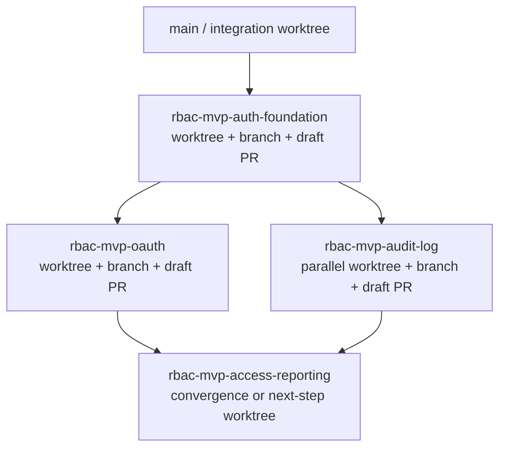
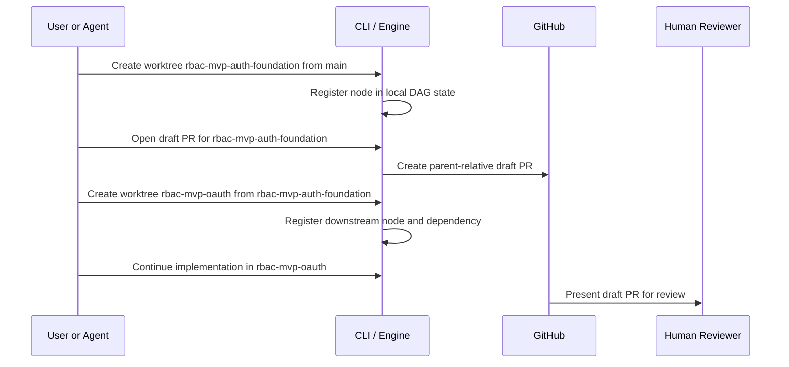
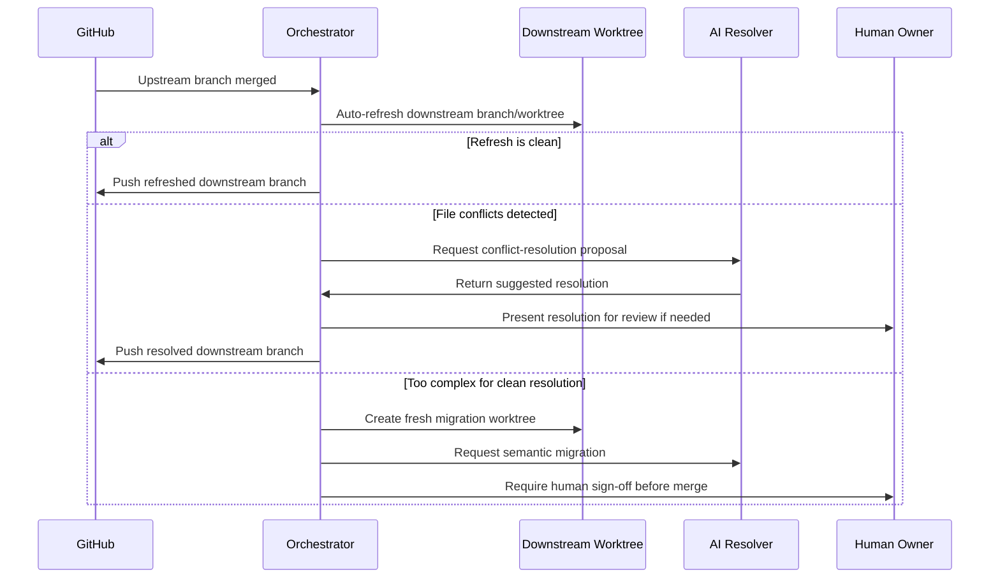
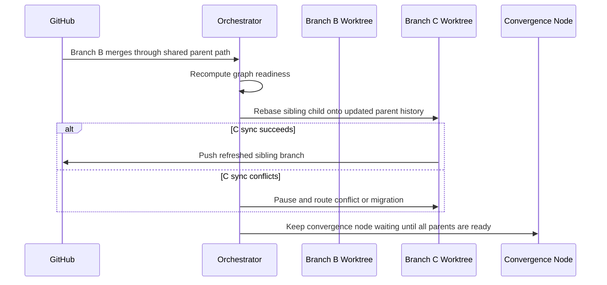

# Proposal: Worktree-Native PR Orchestration for Humans and Agents

## Status

Draft

## Scope

Joint product and feature-direction proposal

## Context and Problem Statement

This product exists to manage the chaos of parallel agent work, out-of-order human review, and the rebasing and file-conflict fallout that follows when whichever PR happens to land first forces the rest of the graph to catch up.

The core workflow problem is this:

- an agent finishes one step of implementation in its own worktree
- that worktree is pushed for human PR review
- while the human review is pending, agents should be able to keep working on the next dependent steps in their own worktrees
- when feedback lands on any related PR, the fixes made there must propagate into the affected in-flight worktrees cleanly and with as little manual coordination as possible

This matters because human review latency should not stall the whole chain of work, but downstream agent work also cannot be allowed to drift away from upstream truth.

At a practical level, branches and PRs behave like work produced by a human team:

- whichever PR gets reviewed, approved, and merged first may simply be a function of timing, reviewer availability, or luck
- that means the system cannot assume merge order will match creation order, branch numbering, or even perceived implementation importance
- the product therefore has to treat rebase and propagation after out-of-order merges as a normal operational path, not an exception
- the same graph may also need to be refreshed because the shared remote integration branch has moved due to other developers' merges

Without orchestration, this creates a painful failure mode:

- agents either share a workspace and conflict with each other
- or they work in isolated branches and worktrees but humans must manually keep every dependent branch in sync
- PR feedback on an earlier branch becomes expensive rebase work or ad hoc reimplementation in every later branch
- reviewers and owners lose clarity about which worktrees are blocked, stale, or ready

This product idea starts from a simple but important observation: Git worktrees already provide the filesystem isolation that agentic development wants, while tools like GitButler provide useful stacked-branch workflows through a virtual-branch model that is optimized around a single working directory and a primarily human-centric interaction model.

The opportunity is to build a worktree-native orchestration layer that makes stacked and graph-shaped branch workflows practical for both humans and agents. The desired outcome is:

- one real branch per worktree
- one real filesystem per active unit of work
- PRs that can be independently reviewed
- downstream work that can continue while upstream PRs wait on humans
- a visual graph of worktrees and dependencies that humans can actually understand
- automated propagation of merged or updated upstream branches into downstream worktrees and branches
- graph-wide or subtree refresh against the remote integration branch when team activity has moved the base
- clear status reporting for which worktrees are current, stale, refreshed, or blocked relative to both local parents and the remote integration branch
- AI-assisted conflict handling and semantic migration for the file conflicts that propagation inevitably creates

The core product problem is not "how do we invent virtual branches again." The core product problem is "how do we manage branch dependency metadata, PR lifecycle, rebases, migrations, and review ergonomics on top of standard Git primitives."

## Core Workflow to Enable

The target workflow looks like this:

1. Agent A implements a change in `rbac-mvp-auth-foundation` and opens a draft PR.
2. A human reviewer now has a visible checkpoint for that branch, even before final sign-off.
3. Agent B continues in `rbac-mvp-oauth` because the next step should not be blocked by review latency alone.
4. Agent C may continue in `rbac-mvp-audit-log` or a sibling branch if the graph allows it, and those branches may also open draft PRs.
5. Human feedback arrives on `rbac-mvp-auth-foundation`.
6. Agent A or another assigned agent updates `rbac-mvp-auth-foundation`.
7. The system automatically propagates that new upstream state into the dependent worktrees, including branches that may already have their own PRs open.
8. If sync is simple, it rebases cleanly.
9. If sync hits file conflicts, AI should assist with resolution by default.
10. If the conflict is too complex for a clean rebase-style resolution, it escalates to semantic migration onto a fresh worktree.
11. A human remains the accountable reviewer and approver before any branch is merged.

Default merge behavior:

- when an upstream branch is merged and its worktree is effectively complete, downstream worktrees should auto-refresh by default
- this auto-refresh should behave like a managed rebase or equivalent propagation step
- if that refresh causes conflicts, AI-assisted resolution should be the default response before escalating further
- when the remote integration branch advances, the system should also be able to refresh all affected worktrees against that base as a managed bulk operation

The system exists to make that loop normal instead of fragile.

Important DAG nuance:

- the workflow may branch in parallel, but Git-host merge events still happen one at a time
- the product therefore needs to support DAG-shaped planning and visualization while still processing propagation as a sequence of concrete branch updates
- parallel branches are about allowing parallel work, not simultaneous merge completion
- worktree creation order, implementation order, PR review order, and PR merge order may all differ
- propagation therefore cannot rely on simple branch numbering alone; it must follow the actual dependency graph and current merge state
- in other words, the system has to behave like a disciplined teammate that continually rebases and reconciles the rest of the graph after whichever PR happened to land first
- the same disciplined behavior should apply when the remote integration branch moves because of teammates' work, since local graphs are never truly isolated from the shared repository

## Solution Overview Diagrams

These diagrams should appear early in the proposal because they explain the shape of the product faster than prose alone.

### 1. Worktree and PR Dependency Shape



Interpretation note:

- this diagram shows dependency shape, not required review or merge order
- `rbac-mvp-oauth` and `rbac-mvp-audit-log` may be reviewed, updated, or merged in a different order from when they were created

### 2. Sequential Creation and Review Flow



### 3. Merge Propagation and Conflict Handling



## Source Material

This proposal synthesizes:

- the shared March 26, 2026 brain-dump conversation captured in the Claude share URL provided for this project
- the Zazz framework and worktree guidance from the sibling `zazz-skills` repo
- the `qb-mono` worktree setup instructions you referenced as an example of the desired bare-repo plus sibling-worktree operating model
- official product and platform documentation for Git worktrees, GitButler, Graphite, and Sapling for competitor and adjacent-workflow analysis

## Scope and Non-Goals

In scope:

- a CLI-first product usable by both humans and agents
- an installable desktop application for graph visualization and review
- Linux and macOS as first-release desktop targets
- worktree and branch lifecycle management
- stack and graph metadata management
- DAG-capable graph modeling from the beginning
- DAG-aware CLI operations from the beginning
- GitHub PR lifecycle awareness
- draft PR workflow as a first-class branch state
- sequential workflows as the first user-facing happy path
- conflict handling with both rebases and semantic migration
- single-machine local orchestration across sibling worktrees on shared disk
- single-user desktop operation for managing a coordinated set of local agents

Out of scope:

- replacing Git with a custom VCS
- supporting every Git host in the initial release
- Windows as a first-release desktop target
- granting agents merge authority
- building a generic project-management suite
- forcing all users into a desktop-only workflow
- multi-machine distributed orchestration for the first release
- multi-user shared DAG coordination for the first release
- agent-owned approval or merge authority

## Business Justification

- The product addresses a real workflow gap between single-human stacked PR tools and multi-agent development.
- It directly reduces the idle time that appears when humans review upstream work while agents are ready to continue downstream work.
- It gives one user a practical way to manage a coordinated group of agents on a single machine without collapsing all work into one shared workspace.
- It creates a differentiated workflow for teams that want isolated, parallelizable, branch-aware execution.
- It improves review quality by showing each branch relative to its true parent instead of always diffing against `main`.
- It makes human validation easier by turning each branch into its own reviewable PR checkpoint.
- It preserves accountability by ensuring a human owner remains responsible for approval and merge decisions.
- It reduces human coordination overhead by making propagation of upstream changes into downstream branches an automated system responsibility instead of a manual chore.
- It aligns naturally with the Zazz framework's worktree-first and Git-native collaboration model.
- It supports the real-world case where smaller downstream PRs may complete before earlier or larger upstream PRs are finished, without losing graph integrity.
- It treats rebase, propagation, and conflict cleanup as core system behavior rather than as recurring human toil.
- It helps one developer stay productive even while the shared team integration branch continues to move underneath their local graph.

## Technical Justification

- Worktrees give real filesystem isolation, which is materially better for agents than virtual branch switching inside one working directory.
- A worktree-per-branch model allows independent testing, terminals, dev servers, and conflict resolution in real files on disk.
- Standard Git operations already cover the primitive mechanics: `worktree add`, `rebase`, `fetch`, `push --force-with-lease`, and branch cleanup.
- The missing capability is orchestration: metadata, cascade triggers, conflict routing, agent coordination, and review UX.
- A graph-aware orchestrator can support both linear stacks and DAG workflows. The initial user experience can privilege sequential flows, but the underlying model should not lock the product into linear-only assumptions.

## Value Proposition and Expected Outcomes

The product should let a user or agent:

- create a new branch and worktree from a chosen parent branch
- register that branch inside a dependency graph
- open a draft or ready-for-review PR against the parent branch rather than only against `main`
- use each branch-level PR as an explicit human validation step for one increment in the larger flow
- let later work continue while earlier PRs are still awaiting human review
- keep child branches updated when parent branches receive feedback or merges
- auto-refresh downstream worktrees by default when upstream branches merge
- keep already-open downstream PRs synchronized when upstream branches change
- support review and merge order that differs from worktree creation order
- surface conflicts to the correct worktree, use AI assistance by default, and escalate to semantic migration when a simple rebase is no longer the right answer
- review stacked changes as clean parent-relative diffs
- visualize the worktree DAG so a human can see parallel branches, dependencies, blocked nodes, and convergence points
- inspect which worktrees are current relative to their parent and which are stale relative to the configured remote integration branch

Expected outcomes:

- better throughput for multi-agent delivery
- less polluted PR review
- clearer human approval points for each step in a larger implementation sequence
- stronger accountability because final sign-off stays with a responsible human
- better situational awareness because the user can see the active worktree graph instead of reasoning from branch names alone
- less manual branch babysitting because merged upstream changes flow forward automatically
- less manual conflict cleanup because AI assistance is part of the default propagation path
- safer experimentation because worktrees are isolated and disposable
- clearer ownership because each agent can map to a specific worktree and branch
- more realistic execution because branch size and review speed do not have to match graph position
- less manual graph auditing because the system can report which worktrees now need refresh after team-originated base-branch changes

## Why Not Just Use GitButler for This Use Case

GitButler is a serious product and likely the better choice for a solo human who wants a smoother stacked-branch workflow inside one working directory.

This proposal is stronger for a different use case:

- one human coordinating multiple agents
- one agent per isolated worktree
- multiple downstream branches continuing while upstream PRs are still under human review
- automatic propagation of upstream changes into already-open downstream branches and PRs

Why this proposal is a better fit for that use case:

- worktrees provide real filesystem isolation, not virtual separation inside one workspace
- each agent can have its own branch, directory, terminal, test loop, and local execution context
- the product is designed around downstream propagation as a core responsibility rather than as a side effect of local branch manipulation
- the product keeps human review checkpoints explicit by making each branch a reviewable PR unit

Why GitButler may be a worse fit for this use case:

- its main strength is reducing friction for one user inside one workspace
- that same model is less natural for many agents working truly simultaneously
- it does not appear to be optimized around automatic propagation across isolated downstream worktrees that may already have their own PRs open

Honest downside of this proposal:

- this approach is more operationally complex than GitButler
- it will only be worth it if the isolation and propagation benefits are important enough to justify that extra complexity

## Market Context and Comparison

This proposal sits in a real product neighborhood, but its combination is still differentiated.

High-level comparison:

- native `git worktree` provides the isolation primitive, but not graph orchestration, PR awareness, or conflict-routing workflows
- GitButler is the clearest direct comparison and likely the better tool for one human managing multiple changes in one workspace
- Graphite, `ghstack`, and similar tools validate that stacked PR workflows are useful, but they are primarily PR-stack tools rather than worktree-native orchestration systems
- open-source worktree and agent tools validate the demand for isolated agent workspaces, but generally stop short of PR dependency orchestration and automated downstream refresh
- Sapling validates that stacked and graph-aware history workflows matter, but it is a broader source-control approach rather than a worktree-native orchestration layer on top of standard Git

The practical takeaway is:

- the idea is not unique in every individual part
- the specific combination of real worktree isolation, CLI-first agent workflows, DAG-aware metadata, and automated downstream propagation still looks differentiated
- GitButler remains the main comparison point, but the honest positioning is "better for agent-oriented, isolated, propagation-heavy workflows," not "better in every way"

## Competitive Positioning Summary

The strongest product position is:

- more Git-native and agent-native than GitButler
- more worktree-native than Graphite
- less disruptive to adopt than Sapling

This position is attractive, but it comes with honest downsides:

- more local complexity than single-directory tools
- more product surface area to build before the experience feels polished
- more responsibility for conflict handling because real worktrees expose real divergence instead of masking it inside a virtual workspace

## Tradeoff Analysis

The strongest recommendation is to build this product in phases:

1. adopt the worktree-native model immediately
2. build the graph and metadata model as DAG-capable from the beginning
3. ship a sequential user-facing workflow first
4. add conflict scoring and semantic migration next
5. expand UI and automation depth for richer DAG orchestration after the core path proves reliable

Key tradeoffs:

- Linear flows are easier to reason about, easier to represent in GitHub, and easier to deliver as an MVP user journey.
- DAG support offers the most strategic upside for agentic workflows, so the data model and CLI should be DAG-native even if the first polished UI experience emphasizes sequential flows.
- Traditional conflict resolution is cheaper for low-complexity rebases, but semantic migration is better for complex logical drift where the code should be re-applied intentionally rather than merged mechanically.
- A repo-local manifest is a good primary source of truth, but mirrored PR metadata should also exist so the graph can be reconstructed when needed.
- Parent-relative PR targeting should be preserved because it is one of the strongest proven ideas in existing stacked-PR workflows; the innovation here is the worktree-native and agent-native execution model around it.

Recommended state model:

- local repo metadata for graph state, worktree registry, and sync lifecycle
- mirrored lightweight metadata in PR body comments or labels for portability and recovery
- machine-readable status for agents via the CLI

## Standards and Constraints Analysis

This proposal aligns well with the Zazz framework:

- it is explicitly Git-native
- it treats worktrees as a first-class execution boundary
- it keeps merge authority with humans
- it keeps approval responsibility with humans even when AI assistance is present
- it preserves durable product reasoning in tracked documents

Current repo constraints:

- this repository is currently a new project with minimal implementation footprint
- GitHub should be the first supported host
- the product should be CLI-first, with the desktop app as a companion layer
- the MVP should prefer reliable Git CLI orchestration over deep custom Git internals
- the default operational model should assume layered branch sequencing even though the underlying graph model remains DAG-capable
- the first-release operating assumption is one physical machine with local disk access to the repo container and its sibling worktrees
- the first-release user model is one human operator managing their local agent workflows from that machine

This proposal also fits the repo's initial standards direction:

- shared engine for CLI and desktop
- JSON output for agent-facing commands
- DAG-capable core model with sequential-first UX where that reduces complexity

## Opinionated Worktree Topology

The product should impose a clear worktree model instead of leaving layout choices fully open-ended.

Recommended operating shape:

```text
repo-container/
├── .bare/
├── dev/ or main/
├── rbac-mvp-auth-foundation/
├── rbac-mvp-oauth/
└── another-feature/
```

Recommended rules:

- use a bare-repo container with sibling worktrees
- keep one clean integration worktree such as `dev/` or `main/`
- create one active branch per worktree
- keep worktrees as visible sibling directories, not nested inside another worktree
- use flat, filesystem-safe names
- prefer human-meaningful names that describe the unit of work rather than its presumed merge order
- allow a numeric suffix only as an optional collision-avoidance or convenience mechanism, not as the semantic source of dependency truth

Why this is the right model:

- it matches the Zazz framework's worktree guidance
- it matches the operational model you are already using successfully in another project
- it keeps branch lineage human-readable without implying that worktrees are nested
- it gives agents predictable locations and keeps cleanup straightforward

State storage note:

- repo-local orchestration state should live with the repo container, while user-level application state should live in the user's home directory
- the exact naming and directory contract should be treated as a feature-level requirement rather than proposal-level detail

## Risks and Mitigations

Risk:
Git edge cases around rebases, force pushes, detached state, and worktree cleanup will create subtle failures.

Mitigation:
Use the system `git` executable in v1, wrap dangerous operations carefully, require dry-run and status inspection modes, and prefer `--force-with-lease` over unbounded force pushes.

Risk:
Local graph metadata can drift from GitHub PR state.

Mitigation:
Use local metadata as primary state, mirror minimal identifiers into PR descriptions or labels, and provide a repair/reconcile command.

Risk:
Rebasing a child while an agent is actively mid-task can disrupt work.

Mitigation:
Do not require disruptive immediate rebases by default. Support staged sync and migration workflows that let the agent resume on a clean basis instead of being interrupted destructively.

Risk:
DAG support becomes a complexity trap too early.

Mitigation:
Ship linear stacks first and treat DAG as a second-wave capability behind stable metadata and sync primitives.

Risk:
Disk usage grows with many worktrees.

Mitigation:
Use managed worktree roots, cleanup policies, and dependency-sharing strategies such as package-manager caches and hardlink-friendly package managers.

Risk:
Semantic migration can invalidate prior PR review context.

Mitigation:
Post migration summaries to the PR, preserve review context in comments, and explicitly request re-review where migrated code changes meaningfully.

## Dependencies and Sequencing Considerations

Near-term dependencies:

- GitHub API integration for PR state
- local DAG-capable graph and worktree metadata model
- a reliable CLI wrapper around Git commands
- a clear managed directory strategy for sibling worktrees and repo-local orchestration state

Later dependencies:

- local daemon or watcher process for real-time sync and UI updates
- AI-assisted conflict and migration services
- richer review visualization for desktop users

Sequencing principle:

- first validate the orchestration engine
- then validate the GitHub lifecycle
- then add semantic conflict escalation
- then add the richer human UI
- then deepen DAG visualization and convergence automation on top of the already DAG-capable core

## Preliminary Product Architecture

Recommended architecture:

- shared core engine for metadata, sync planning, and orchestration
- CLI for humans and agents
- local daemon for watch, webhook, and streaming state
- desktop app for graph, review, and conflict UX
- GitHub adapter for PR and branch metadata
- optional AI services for semantic migration and conflict assistance

Recommended metadata shape:

- graph manifest keyed by branch node, with support for one or more parent references
- worktree registry keyed by local path and branch name
- PR metadata keyed by branch and remote ID
- agent ownership metadata for routing conflicts or migration tasks
- conflict artifacts keyed by failed operation and worktree identity

## Preliminary Feature Breakdown

### Feature 1: Runtime and Tooling Prerequisites

Capabilities:

- detect whether Git is installed and available on the system path
- detect whether the target repo is compatible with the required bare-repo plus sibling-worktree model
- validate host platform support for the CLI and desktop app
- validate required auth and remote-host prerequisites before PR operations begin
- provide setup guidance when prerequisites are missing

Why it matters:

- the product cannot operate safely if the host environment and repo layout are not compatible
- this feature makes the desktop app and CLI self-diagnosing instead of mysterious when setup is incomplete

### Feature 2: Git Interaction Engine

Capabilities:

- wrap core Git commands safely and consistently
- manage branch creation, checkout, fetch, rebase, push, cleanup, and worktree operations
- normalize Git output into structured results for the CLI and desktop app
- enforce safe defaults such as dry-run support and `--force-with-lease`

Why it matters:

- this is the foundational feature that everything else builds on
- the product is fundamentally an orchestration layer on top of Git, so Git interaction is a distinct core capability rather than just an implementation detail

### Feature 3: Repository Bootstrap and Metadata Model

Capabilities:

- initialize orchestration metadata in a target repo
- register graph nodes, one-or-more parent relationships, worktree paths, PR IDs, and state
- reconcile local metadata with GitHub state
- track the local DAG structure across sibling worktrees on one machine

Why it matters:

- everything else depends on a trustworthy DAG-capable source of truth

### Feature 4: Worktree Lifecycle Management

Capabilities:

- create a branch from a selected parent
- create a sibling worktree in a managed container directory
- enforce the opinionated bare-repo plus sibling-worktree layout
- generate or validate flat, human-meaningful worktree names
- optionally add a numeric suffix when needed for uniqueness, but not as dependency truth
- materialize configured local-only user files and settings into newly created worktrees
- inspect, list, clean up, and repair worktrees

Why it matters:

- this is the foundation for the whole worktree-native product model
- if new worktrees are not immediately usable, the workflow regresses relative to standard single-directory branching

### Feature 5: DAG-Aware Sync and PR Lifecycle Core

Capabilities:

- open parent-relative draft PRs and ready-for-review PRs
- detect parent updates from review feedback or merge events
- propagate updates to dependent branches based on graph relationships
- optimize first for layered branch sequencing as the default workflow
- auto-propagate merged upstream changes into downstream worktrees by default
- keep downstream branches and their already-open PRs synchronized as upstream branches change
- support merge and review order that differs from node creation order
- detect when the configured remote integration branch has advanced
- mark affected worktrees as stale relative to that remote base
- support graph-wide or subtree refresh against the configured remote base
- expose a `worktree list` or `status` view that shows freshness relative to both parent and remote integration branch
- update branch and PR state after a successful sync

Why it matters:

- this is the orchestration layer that turns Git primitives into a real graph-aware product
- automated propagation is one of the core product benefits, not just an internal implementation detail

### Feature 6: Agent Ownership and Automation Hooks

Capabilities:

- let an agent claim a branch or worktree
- expose machine-readable status and responsibilities
- notify the correct agent when a branch needs sync, conflict work, or migration

Why it matters:

- agent workflows need explicit routing, not just branch state

### Feature 7: Review and Graph Visualization UI

Capabilities:

- graph view of branches, PRs, and statuses
- visualize one-to-many branch relationships and convergence points as a true DAG
- parent-relative diffs
- embedded diff viewer for branch-to-parent and file-level inspection
- conflict visualization
- cascade progress display
- show propagation paths, blocked nodes, stale descendants, and ready-to-sync branches
- support for standard diff and merge tooling where that is sufficient
- a path to a graph-aware conflict surface when generic diff tools are not enough

Why it matters:

- humans need a review surface that is better than flat GitHub PR lists for stacked or graph-based work

### Feature 8: AI-Assisted Diff, Merge, and Conflict Resolution

Capabilities:

- classify rebase conflicts by complexity
- use AI-assisted resolution as the default path for file conflicts
- create a fresh target worktree and migrate branch intent for hard conflicts
- summarize migration back into the PR history

Why it matters:

- this is the product's most distinctive agent-friendly execution advantage

### Feature 9: DAG Review and Convergence UX

Capabilities:

- support one parent with multiple children
- track waiting states for convergence nodes
- trigger sibling updates when one child merges into the shared parent path
- model the practical rule that merges still land one at a time even in a parallel branch graph
- help users understand when a convergence node is conceptually ready versus operationally blocked on prior merge order
- help users understand that smaller downstream branches may merge before larger upstream siblings or ancestors when the dependency graph allows it

Why it matters:

- this is where the already DAG-capable core becomes legible and comfortable for humans at scale

## Product Prerequisites and External Dependencies

Required before the CLI can operate:

- Git installed locally
- a target repository already cloned or initialized
- a repo layout compatible with the required bare-repo plus sibling-worktree model, or a bootstrap command that can convert/create that layout
- network access and authentication for the configured Git host when PR operations are used
- all managed worktrees available on the same local machine and filesystem boundary

Required before the desktop app can operate:

- all CLI prerequisites
- local access to the repo container and its sibling worktrees
- supported operating system: macOS or Linux for the first release

Expected external systems and tools:

- Git as the underlying source-control engine
- GitHub as the first supported PR host
- an AI provider for conflict assistance and semantic migration
- optional external diff and merge tools when the user wants a familiar fallback experience

Future extension, not MVP:

- AI-assisted PR review to help humans review faster

Important boundary:

- AI review may assist, summarize, and recommend, but it does not replace the accountable human reviewer

Explicit non-goal for the first release:

- coordinating worktrees spread across multiple different machines
- coordinating one shared DAG across multiple different human operators

Likely bootstrap flows the product should support:

- initialize a new repo container in the opinionated layout
- inspect an existing repo and report whether it can be adopted as-is
- guide the user through missing requirements such as Git auth, remote setup, or unsupported worktree topology

## Recommended MVP and Implementation Plan

### Phase 1: DAG-Capable CLI Foundation

Deliver:

- prerequisite and environment detection
- Git interaction engine
- repo init
- branch and worktree creation from parent branch
- repo-local orchestration state
- graph manifest and graph status
- opinionated sibling worktree bootstrap, naming, and creation
- local-user file materialization for newly created worktrees
- worktree list/status output with parent and integration-base freshness signals
- readiness verification so a newly created worktree can actually be used immediately
- safe cleanup

Success criteria:

- a user can create a new managed worktree, have the required local-only files and settings materialized automatically, and begin working without the usual manual bootstrap pain

Note:

- the CLI feature document now treats the CLI MVP as one milestone whose deliverables cover local DAG state, worktree creation, PR lifecycle, automated refresh/rebase, and AI-assisted conflict handling
- the phased plan here is still useful as a product rollout and implementation-order recommendation, but the feature-level milestone model is intentionally broader

### Phase 2: GitHub PR Integration

Deliver:

- open draft and ready-for-review PRs against parent branches
- sync local state with PR state
- detect parent updates and merged state
- update mirrored metadata in PR descriptions or labels
- agent-readable status for branches, PRs, and dependency state

Success criteria:

- a user can manage parent-relative PRs against GitHub without manual bookkeeping

### Phase 3: Sequential-First Sync Engine on Top of the DAG Core

Deliver:

- ordered rebase propagation for sequential dependency paths
- automatic downstream refresh when upstream branches merge
- refresh of all affected worktrees when the configured remote integration branch advances
- paused state on conflict
- explicit sync logs and dry runs

Success criteria:

- local and remote upstream changes can propagate through the most common dependency paths with safe observability

### Phase 4: Semantic Migration Escalation

Deliver:

- conflict scoring
- fresh migration worktree creation
- agent migration workflow
- PR summary comments after migration

Success criteria:

- hard conflicts can be recovered without forcing brittle manual merge resolution

### Phase 5: Desktop Review Experience

Deliver:

- graph view
- true DAG visualization for branch and worktree relationships
- parent-relative diff review
- embedded diff viewer
- conflict and migration visualization
- live sync status from local daemon events
- integration with normal diff and merge tooling before a full custom merge surface exists

Success criteria:

- humans can understand and review stacked work without relying only on GitHub's flat PR UI

### Phase 6: AI-Assisted Conflict UX

Deliver:

- file-level conflict review surface
- AI-generated merge and conflict suggestions
- human approval flow for AI resolutions
- escalation path to semantic migration for hard cases

Success criteria:

- ordinary propagation conflicts can be resolved inside the product with AI assistance and human oversight

### Phase 7: Rich DAG Automation and Convergence Support

Deliver:

- sibling branch propagation from a shared parent
- waiting and readiness state for convergence nodes
- richer graph validation
- explicit handling of sequential merge reality inside a DAG-shaped workflow

Success criteria:

- parallel child branches can coexist safely with explicit orchestration rules

## UI Recommendation for Conflict Resolution

The product probably should include a conflict-resolution experience, but it does not need to reinvent merge tooling on day one.

Recommended approach:

- use AI-assisted resolution as the primary path for ordinary file conflicts
- use standard diff and merge viewers as a fallback and inspection aid
- focus the product UI first on graph context, branch ancestry, parent-relative diffs, and propagation status
- add a custom conflict-resolution surface only when graph awareness or AI-assisted migration gives a clear advantage over generic tools

Why:

- AI assistance is part of the product assumption, especially when layered branches need fast forward-propagation
- ordinary merge conflicts can still benefit from existing diff tools as a fallback
- the unique value here is not just editing conflict hunks
- the unique value is understanding which worktree is stale, why it is stale, what upstream changed, and how that should propagate through the graph

## Detailed DAG Propagation Diagram

The early diagrams explain the product shape. This deeper diagram focuses on the non-trivial case: a shared parent with parallel descendants and a later convergence point.

### DAG Sibling Merge Propagation and Convergence Readiness



## Technology Recommendation

Recommended build approach:

- Rust for the shared orchestration engine and CLI
- Rust for the desktop host layer
- Tauri for the installable desktop application shell
- React plus TypeScript for the desktop UI
- `xyflow` for DAG and node-graph visualization
- `petgraph` or equivalent Rust graph library for the core DAG model and algorithms
- SQLite for local persistent state and event history
- system `git` invocation for v1 orchestration
- GitHub API integration through a dedicated adapter layer

Why this is the best fit:

- Rust is a strong fit for a reliable local engine, a fast CLI, and a desktop host process.
- Rust is also a reasonable fit for the whole product if the team explicitly values the experience of building a native Rust application.
- Tauri lets the product ship as a real installable desktop app while using a modern TypeScript UI on top of a Rust engine.
- React plus TypeScript is a strong fit for a stateful DAG tool where node state, PR state, worktree metadata, and propagation state will get complex quickly.
- `xyflow` gives the desktop app a professional-grade DAG interaction layer without requiring us to invent node-based UI behavior from scratch.
- `petgraph` is a good fit for the Rust-side graph model, path logic, dependency traversal, and validation rules.
- A graph-heavy, diff-heavy review interface will likely still be faster to deliver well in a modern web UI than in a pure-Rust UI framework for the first polished release.
- This approach also creates a clean path where the CLI and desktop share the same core logic instead of diverging into two products.

Assessment of pure-Rust desktop UI options:

- Yes, there are credible Rust UI libraries now, so an all-Rust build is no longer a fantasy.
- Slint looks like the strongest pure-Rust candidate if the goal is a serious desktop product with a declarative UI model and cross-platform support.
- iced is also viable, especially if a more code-centric UI architecture is preferred.
- Even so, Tauri remains the pragmatic default if the priority is fastest path to a polished graph-and-diff experience.
- If "build the whole thing in Rust because it should be good and because it is fun" is an explicit product value, a pure-Rust route is reasonable and worth taking deliberately.

Alternative if speed-to-market dominates:

- a TypeScript-only prototype could validate product mechanics quickly
- but the recommended longer-lived architecture is still Rust-first

## Recommendation

Proceed with a worktree-native orchestration product, but do it deliberately:

1. commit to the real-branch and real-worktree model
2. commit to a DAG-capable metadata and CLI model from day one
3. support GitHub PR awareness and parent-relative diffs early
4. add semantic migration before or alongside the first rich UI
5. use a sequential-first user experience initially without compromising the DAG-capable core

Delivery recommendation:

- build the CLI first
- use the CLI to prove the worktree, PR, propagation, and conflict workflows in real development
- add the desktop app after the behavior is solid enough that the UI is visualizing a workflow we already trust

Why CLI-first is the right path:

- agents will use the CLI anyway
- it removes UI complexity from the hardest early product questions
- it lets us validate the propagation model before we spend time polishing visualization
- it gives us a real internal tool we can use while building the desktop app itself

This should not be positioned as a GitButler clone. It should be positioned as a worktree-native orchestration layer for humans and agents that uses ordinary Git primitives to unlock isolated execution, cleaner review, and smarter propagation.

## Decision Checklist

- Do we want GitHub to be the only supported remote host for MVP?
- Do we want to formalize the product as CLI-first with desktop second, rather than trying to launch both at equal depth?
- Do we want local repo metadata plus mirrored PR metadata as the graph-state model?
- Do we want semantic migration included in the first public milestone, or staged for the second one?
- Do we want DAG support in the initial roadmap but explicitly out of MVP scope?

## Open Questions

- What should the product be named?
- Should the local metadata live in a hidden repo folder, a managed app folder, or both?
- Should branch names remain user-controlled while worktree folder names are sanitized and tool-managed?
- Do we want webhook support, polling, or both for GitHub state changes?
- How much of PR review should happen in the desktop app versus remaining in GitHub?
- Which AI provider or provider abstraction should power conflict assistance and semantic migration?

## Discussion Log / Notable Arguments

- Real worktrees are better than virtual branches for multi-agent execution because they provide actual directories, not simulated state.
- The stack or graph relationship should exist as metadata, not as nested worktree directories.
- Sequential stacks are already cleaner with worktrees because each branch can be run and tested independently.
- DAG support is compelling because one parent can feed multiple child worktrees in parallel, but it should not be forced into the MVP.
- Clean parent-relative diffs are a major user-facing advantage over GitHub's default stacked review experience.
- Complex conflicts may be better handled by creating a fresh worktree and migrating intent than by trying to salvage a large textual merge.
- Worktrees are storage-efficient relative to full clones because Git object storage is shared; the primary extra disk cost is checked-out files and local dependencies.

## Sign-off Outcome and Next-Phase Handoff

Current outcome:

- the concept is strong enough to proceed into feature-definition and MVP planning
- the strongest initial path is a CLI-first linear-stack product with a Rust core and Tauri desktop companion

Recommended next artifacts:

- author a formal feature document for the overall product capability
- create the first deliverable SPEC for the CLI foundation and metadata model
- create the follow-on deliverable SPEC for GitHub PR lifecycle and cascade sync
